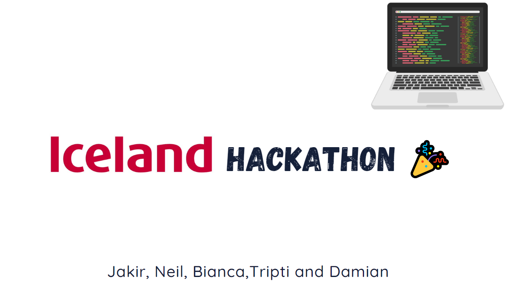
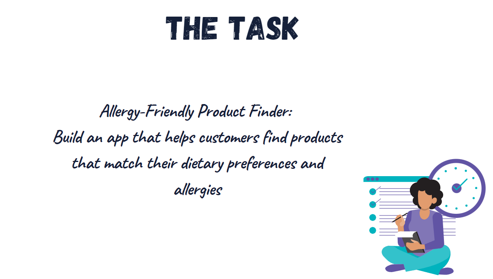
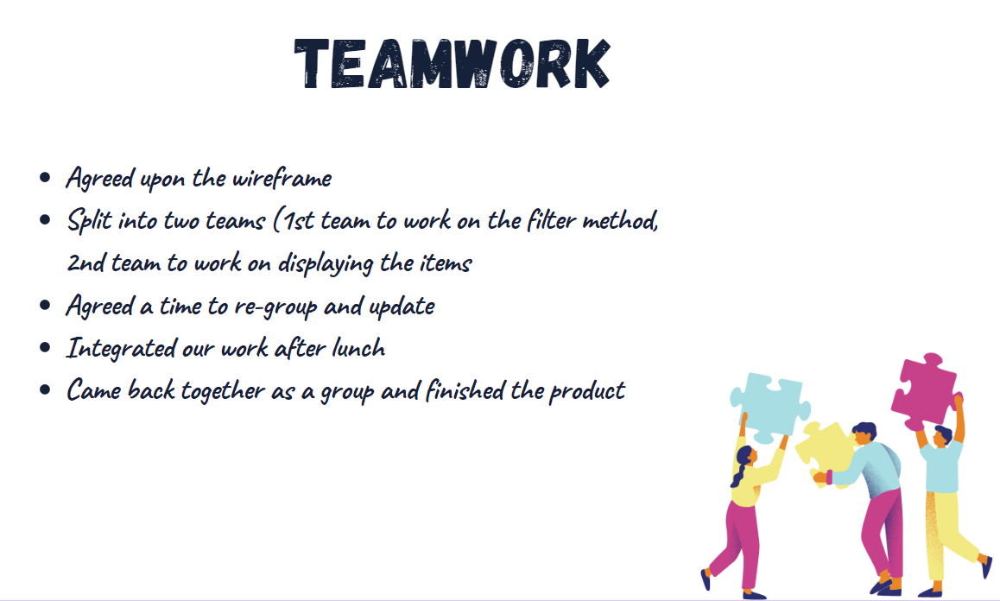
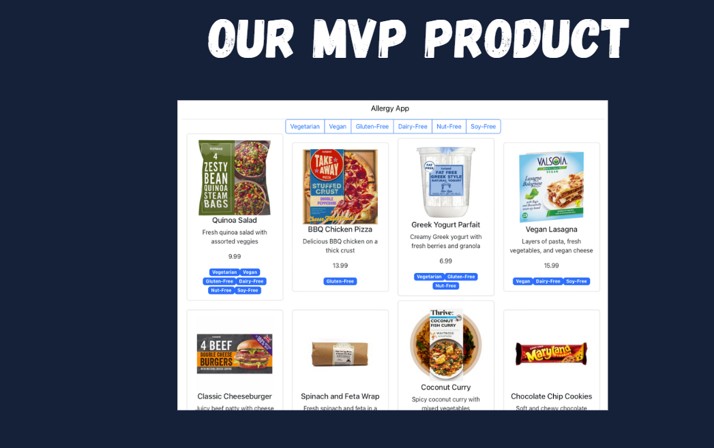
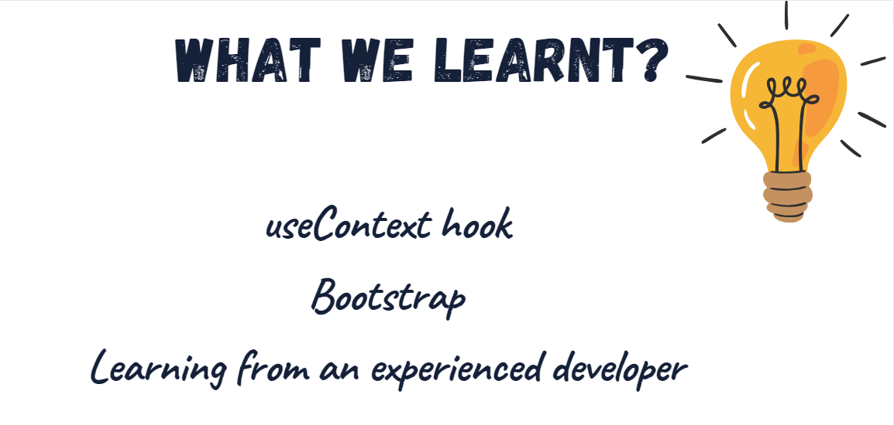
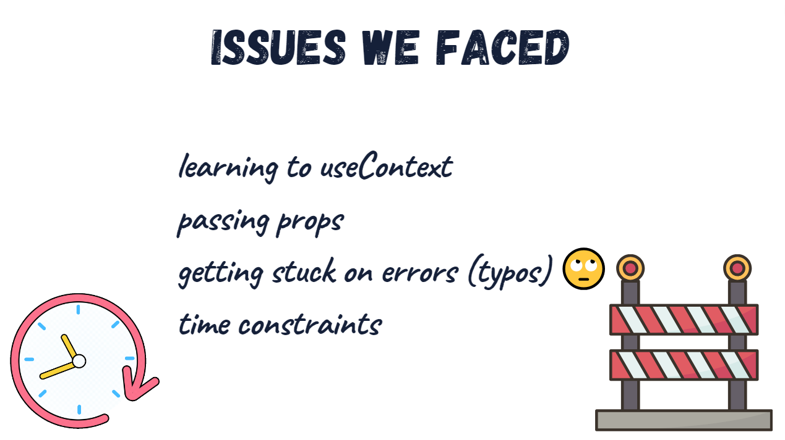
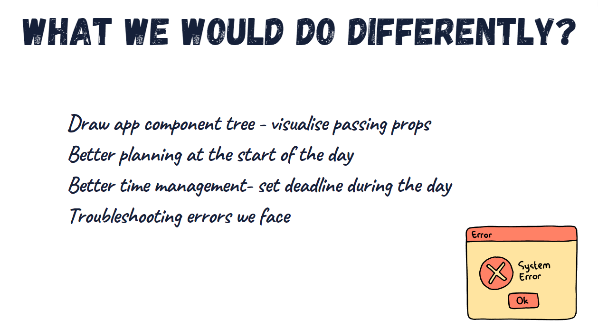
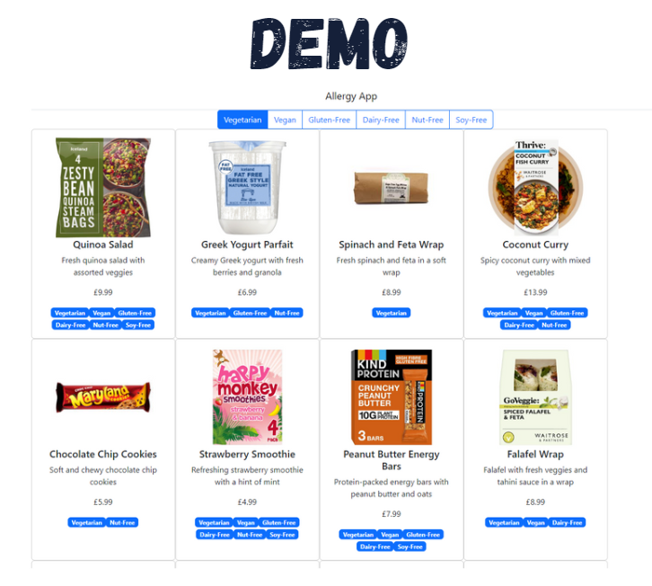

# 100 Days Of Code Diary / School of Code Bootcamp Diary

## Day 1

Monday 6th March 2023

### **Today's progress**:

- I learnt a new mark-up language called Markdown 
- Sorting out my GitHub repos ready for the bootcamp.
- I used markdown to create README docs for this diary.
- On Codecademy learning links and buttons.
- On FreeCodeCamp, did a few tasks for the <italics>"Learn More About CSS Pseudo Selectors By Building A Balance Sheet"</italics>

### Thoughts:

I'm feeling really excited to have started 100 Days Of Code and already feel more motivated to code every day. I think having a goal of just one hour a day seems very manageable for me, rather than feeling like unless I spend at least 3 hours a day learning it's not worth it.

### Links to work / resources:

Shortcuts for VSCode: 
- Mac: [https://code.visualstudio.com/shortcuts/keyboard-shortcuts-macos.pdf] <br>
- Windows: [https://code.visualstudio.com/shortcuts/keyboard-shortcuts-windows.pdf]

----------------------------------------------------------------------------------------------------
## Day 2

Tuesday 7th March 2023

### **Today's progress**:

- On Codecademy learning links and buttons.
- On FreeCodeCamp, did a few tasks for the <italics>"Learn More About CSS Pseudo Selectors By Building A Balance Sheet"</italics>
- Watched the Binance Charity x School Of Code Virtual event to hear about the training programme and previous alumni.
- Did a mini project on how to code a wavey text animation after seeing a video on tiktok.

### Thoughts:
Relaxed in the morning and saw the Binance x School of Code collaboration after being shared on Slack and decided to watch the virtual event to find out more about the School of Code programme and how alumni found it and how they ended up in their current job. Sounds like although the programme is intense and challenging, it's a great way to learn and gain skills to continue learning and highly rewarding. Very excited to start the course now!

### Links to work / resources:
- Drink wavey text animation [https://codepen.io/trip25/pen/VwGMPBZ]


----------------------------------------------------------------------------------------------------
## Day 3

Wednesday 8th March 2023

### **Today's progress**:

- On FreeCodeCamp, did a couple more tasks for the <italics>"Learn More About CSS Pseudo Selectors By Building A Balance Sheet"</italics>
- On Codecademy learning links and buttons. Looking at the Button designs for example Skeuomorphism and Flat Designs.
- Pre-course social 18:30 pub quiz- talk with other bootcampers

### Thoughts:
Continued freecodecamp and codecademy, typing with frozen fingers as it snowed in March! Met the other bootcampers in the SOC pre-course social event wehere we had multiple rounds on films, science, geography and diltoids. Everyone seems lovely and will need to get enough rest for Monday! Also going through the Git learning website linked below, shared by another bootcamper, just to jog my memory.

### Links to work / resources:
- https://learngitbranching.js.org/

----------------------------------------------------------------------------------------------------
## Day 4

Thursday 9th March 2023

### **Today's progress**:
- Watched a video explaining the Internet of Things (IoT)
-Codecademy: read article on Affordances, Signifiers, and Clickability

### Thoughts:
Not much coding/learning for today as I spent time with my mum with personal chores and very tired from driving around all day. I did watch a video on the Internet of Things and read an article on Codecademy. 

### Links to work / resources:
- https://www.youtube.com/watch?v=LlhmzVL5bm8&ab_channel=edureka%21<br>
- https://www.codecademy.com/journeys/full-stack-engineer/paths/fscj-22-web-development-foundations/tracks/fscj-22-improved-styling-with-css/modules/wdcp-22-learn-links-and-buttons-7c515143-5864-4beb-9b48-5c1d1528124e/articles/ui-design-affordances-signifiers-clickability
----------------------------------------------------------------------------------------------------
## Day 5

Friday 10th March 2023

### **Today's progress**:
- Further reading on :
  - Signifiers, Not Affordances by Don Norman. This article discusses a bit of the history of thought around affordances and signifiers, and their importance in design.
  - UI Patterns.com has many examples of solutions to common design patterns in web design.
-Completed links and buttons on Codecademy and a project called Summit. Now moving onto "Learn Secondary Navigation" 

### Thoughts:
-Learning more about UI is quite interesting and will consider a deeper understanding of it once I'm more familiar with CSS.

### Links to work / resources:
- https://jnd.org/signifiers_not_affordances/
- https://ui-patterns.com/ 

---------------------------------------------------------------------------
## Day 6

Saturday 11th March 2023

### **Today's progress**:
- Carried on working with freecodecamp and finally finished all 65 tasks of <italics>"Learn More About CSS Pseudo Selectors By Building A Balance Sheet"</italics>
  
### Thoughts:
- Not too much coding today, just carrying on with freecodecamp and getting more familiar with CSS selectors. 
  <br>Also got a back ache so can't sit for long periods of time.
  
### Links to work / resources:

----------------------------------------------------------------------------------------------------
## Day 7

Sunday 12th March 2023

### **Today's progress**:
-  Starting on the Freecodecamp <italics>"Learn Intermediate CSS by Building Picasso Painting"</italics>, has a total of 89 tasks.  Completed 12 tasks so far.
- Prepped for School of Code, checking zoom and other applications are up to date.

### Thoughts:
Quite nervous and excited to be starting School of Code tomorrow and getting back into the 9-5 routine. My back is still aching but hopefully by stretching it regularing I should be ok for the course.

### Links to work / resources:

----------------------------------------------------------------------------------------------------
## Day 7

Monday 13th March 2023

### **Today's progress**:
- First day of the School of Code programme, we had an intro to the programme by the founder and also had some ice breaker sessions in between. We went through Computational Thinking and also a guide to Thinking.
- Pair programming practice with CSS Diner and getting used to sharing our screen. Ironed out any technical issues.
- Discussed how to solve problems in our breakout rooms.
    1. Understand the problem
    2. Break down the problem
    3. Look for patterns
    4. Model the real world
    5. Write an algorithm
- Waterfall vs Agile

### Thoughts:
- Prediction: I will be very tired by the end of the day xD This was true, very interesting and learning to get into the mindset of being comfortable of being comfortable and not to be afraid to ask questions as everyone is in the same boat, with the same goal! 
- I enjoyed the CSS diner as it was a nice visual way to see the question and hoe to figure out the answer. Whilst also getting to grips with pair programming, one person being the driver while the other is the navigator.

### Links to work / resources:
- CSS Diner https://flukeout.github.io/ <br>
- Video about Learning: https://www.youtube.com/watch?v=i8oDLO7GPsk   <br>
- NSDR: https://www.youtube.com/watch?v=AKGrmY8OSHM  


----------------------------------------------------------------------------------------------------
 ## Day 8

Tuesday 14th March 2023

### **Today's progress**:
-Collaborative puzzles
-Flowchart to plan our graduation 4 months away!
-Login and higher/lower quiz made in Scratch
-Using Git commands in the terminal for the Romeo and Juli-git, adding lines, git pushing/pulling.

### Thoughts:
Got put in our first SOC coding pair with Tristan and Umamah, so spent the day in and out of breakrooms with them, working on some space puzzles. It was a fun and interesting learning to communicate and collaborate on tasks, specifically the space puzzles where we were initially stumped but somehow kept going to find the answer!

### Links to work / resources:
- Hack the Galaxy: Puzzle 35 Space Pack
- https://github.com/SchoolOfCode/bc14_w1d2_workshop_git-in-teams-room-62-tripti-umamah-tristan
----------------------------------------------------------------------------------------------------
 ## Day 9

Wednesday 15th March 2023

### **Today's progress**:
-Introduction to JavaScript- Workshop 101 and 102

### Thoughts:
Found JavaScript to be quite interesting but when it came to doing the tasks, our team would get muddled a bit. So I think I will look over some resources from freecodecamp and Microsoft to see if I can get to better grips of it. Also had to work on pushing to github after class as it wasn't working well on my pc, but managed to fix it using my mac instead.

### Links to work / resources:
- https://learn.microsoft.com/en-gb/training/modules/web-development-101-variables/1-introduction
- https://github.com/SchoolOfCode/bc14_w1d3_workshop_js-101-room-62-tripti-umamah-tristan
- https://github.com/SchoolOfCode/bc14_w1d3_workshop_js-102-room-62-tripti-umamah-tristan
----------------------------------------------------------------------------------------------------
 ## Day 10

Thursday 16th March 2023

### **Today's progress**:
- Morning Mindful sessions: Feedback
- JavaScript: Objects, Lists, Arrays, If/Else, While loops

### Thoughts:
From yesterdays fiasco with trying to push back into the exercise from the gtihub classrooms, today seemed to go a lot more smoother. I've grasped the JavaScript Objects and Arrays. Hopefully it goes even smoother tomorrow for our first hack-a-thon! 

### Links to work / resources:
- https://developer.mozilla.org/en-US/docs/Web/JavaScript/Reference/Operators/Addition_assignment 
- https://github.com/SchoolOfCode/bc14_w1d4_workshop_objects-room-62-tripti-umamah-tristan 
- https://github.com/SchoolOfCode/bc14_w1d4_workshop_arrays-room-62-tripti-umamah-tristan

----------------------------------------------------------------------------------------------------
 ## Day 11

Friday 17th March 2023

### **Today's progress**:
-Hackathon: Making a game of Rock, Paper & Scissors using JavScript!

### Thoughts:
I am exhausted brb <br>
Ok I put some eyedrops in and had a nap, started off in the morning with a re-cap of the weeks topics.
Then from just before lunch to around quarter past four we worked on the tasks of the below github class. It was quite challenging and at parts we were quite mystified on why it didn't work and did work! <br> 
I found it very interesting seeing how other people tackled the code and learnt not to be afraid of messing around and trying different things to see if it works. It was also nice feeding back to other groups in a small setting to see how others found it! All in all a challenging and exciting day! That's the first week done.

### Links to work / resources:
- https://github.com/SchoolOfCode/bc14_w1d5_hackathon_rps-room-62-tripti-umamah-tristan

----------------------------------------------------------------------------------------------------
 ## Day 12

 Saturday 18th March 2023
### **Today's progress**:
Spent most of the day catching up with long distance friends so I guess today has been quite low on coding. Will be going over what I learnt over the week in SOC;<br>
•	Computational thinking<br>
•	Declaring and assigning variables<br>
•	Using variables<br>
•	Types<br>
o	  Primitive types (strings, numbers, booleans)<br>
o	  Arrays and objects<br>
•	Functions<br>
o	  How to declare a function (with parameters)<br>
o	  How to call a function (with arguments)<br>
o	  How to use a function’s return value (if there is one)<br>
•	Loops<br>
o	While<br>
o	For<br>
•	If statements<br>
•	Operators (+, -, *, /, =, %, etc.)<br>
-Also worked on a couple more tasks in Codecademy and Freecodecamp.<br>

### Thoughts:

### Links to work / resources:

----------------------------------------------------------------------------------------------------
 ## Day 13

Sunday 19th March 2023

### **Today's progress**:

-Attempted the w3Schools JavaScript test to see how much I know [22/25 = 88% TimeSpent 4:09]

### Thoughts:
I feel better having looked back at the topics I have learnt over the week. But definitely feel I still need to practice practice practice writing the code. And to understand what the questions are asking of me,because I know I try to over complicate things by over thinking!

### Links to work / resources:

----------------------------------------------------------------------------------------------------
 ## Day 14
Monday 20th March 2023
### **Today's progress**:
- Met up with my industry mentor
-Recap Quiz [ 19/20 ]
-Giving feedback
-Code Wars with new pairs
-HTML Document Object Model Workshops
### Thoughts:
It was nice to give feedback to the pair I was working with last week and nice to meet the new pair this week! 
I think using pair programming has definitely helped break down the problems and also to see how others tackle/ interpret the task question. Definitely feel like last week's lessons have cemented more in my brain and very excited to finally use JavaScript change the webpage slowly!

### Links to work / resources:
- https://github.com/SchoolOfCode/workshop_intro-to-codewars
- https://github.com/SchoolOfCode/workshop_DOM-101-in-console
- https://github.com/SchoolOfCode/bc14_w2d1_workshop_dom-102-Trip25

----------------------------------------------------------------------------------------------------
 ## Day 15

 Tuesday 21st March 2023

### **Today's progress**:
- Recap Quiz (Full marks!!)
- Started off with CodeWars exercises
- Talk from Alumni 
- Learnt about Events
- Worked on the Events workshop
- Worked on a individual workshop RPS DOM

### Thoughts:
Felt half like I knew DOM elements and Events and how to link them but also felt lost at times when trying to actually execute the task. I will need to revise more on this topic and maybe also watch tutorials as well as asking ChatGPT and using Github copilot for explanations and planning properly!
I did have a go after class (after a much needed dinner!) to look through the RPS files and see why the events were not working properly and managed to work it how somehow. Also added a box shadow and some colour but kept it pretty simple for now. I do plan on re-visiting another time to add images.

### Links to work / resources:
- https://github.com/SchoolOfCode/bc14_w2d2_workshop_events-101-team-room-41-naomi-shervin-tripti
- https://github.com/SchoolOfCode/bc14_w2d2_workshop_rps-in-dom-Trip25 

----------------------------------------------------------------------------------------------------
 ## Day 16

 Wednesday 22nd March 2023

### **Today's progress**:
- Recap Quiz
- CodeWars
- Asynchronous JavaScript
- API (Application Programming Interface)

### Thoughts:
So today we learnt about Asynchronous Javascript and had to work on getting the clock hands to move, which was a struggle ngl. Afterwards we learnt about API and made a webpage which uses a cat fact API, very interesting and I will definitely have a go with other public APIs.

### Links to work / resources:
- https://github.com/SchoolOfCode/bc14_w2d3_workshop_async-clock-naomi-shervin-tripti-room-41
- https://github.com/SchoolOfCode/bc14_w2d3_workshop_fetch-Trip25

----------------------------------------------------------------------------------------------------
 ## Day 17

 Thursday 23rd March 2023

### **Today's progress**:
- CodeWars Challenges
- Mindset Sessions: Working with different personalities
- UI Guest Talk: Paavan Buddhder
- Team Research: Deeper dive into obscure html tags
- Kumospace- Talk on how to use notion for studying/progress

### Thoughts:
A nice change of pace today as I had time to slow down and calm down(although probably eye of the storm for tomorrow's hackathon!)Learn about cognitive diversity, we tookt he Myers Briggs Test before to find out all our different personality types and how to work effectviely as a team adn also if we were managers. Very interested in learning more about the UI/UX side, which we are apparently going to be learning next week, which is exciting. Ended of the afternoon with a group research task where we were all given different topics to research and later present. We recorded via zoom and uploaded to YT(unlisted), so the class will be able to access it later and hopefully learn. Was also nice to talk to more people outside of our pairs and how they found the course. Also got introduced to Exercism which is similar to Codewars and hopefulyl another resource to practice and improve my technical skills.


### Links to work / resources:
- https://eloquentjavascript.net/00_intro.html 
- https://exercism.org/tracks/javascript/

----------------------------------------------------------------------------------------------------
 ## Day 18

 Friday 24th March 2023

### **Today's progress**:
Hackathon- Feth API

### Thoughts:
This time round the hackathon was very enjoyable, it was great to discuss and be creative with our ideas. We chose the Pokemon API which seemed fun at first but there was a vast amount of data which we had to work out how to manipulate to reflect well on our website. It was also nice to be able to see other peoples projects and present our own in a smaller group.

### Links to work / resources:

----------------------------------------------------------------------------------------------------
 ## Day 19

 Saturday 25th March 2023

### **Today's progress**:


### Thoughts:
My BIRTHDAY!! Off to London for a day out and catch up with my friends. TBC
Doing some reading on JavaScript and watching CS50 video lectures.

### Links to work / resources:
- https://www.youtube.com/watch?v=x5trGVMKTdY&ab_channel=CS50

----------------------------------------------------------------------------------------------------
 ## Day 20

 Sunday 26th March 2023

### **Today's progress**:
Worked on the recap tasks today, went over the JavaScript fundamentals, for loops. And also started learning UI/UX so I can learn a bit before we start learning it this weeek! 
Also tried some exercism tasks which is helping me understand and separate the problems a bit better! 
### Thoughts:

### Links to work / resources:

----------------------------------------------------------------------------------------------------
 ## Day 21

 Monday 27th March 2023

### **Today's progress**:
- Started off with a guest speaker who was a School of Code Cohort 2 Alumni and told us about his career and is now in SRE which is Site Reliability Engineer which was a very interesting insight as he did hop into a lot of varied positions. 
We also started UI/UX design and focused on CSS Flex Design and CSS Grid.

### Thoughts:
We tried to re-create the Google website, with just the HTML file and I can see I still have a lot of work to do! 

### Links to work / resources:
- https://css-tricks.com/snippets/css/a-guide-to-flexbox/
- https://flexboxfroggy.com/
- https://css-tricks.com/snippets/css/complete-guide-grid/
- https://cssgridgarden.com/
----------------------------------------------------------------------------------------------------
 ## Day 22

 Tuesday 28th March 2023

### **Today's progress**:
Recap Quix on Agile methodology and CSS Design.Today learnt about Design Thinking and designing user profiles, user flowcharts and the five stages of Design: Empathise, Define, Ideate, Prototype, Test. It's very interesting and I'm considering this as one of the pathways to get a job in. Also tried (paper)prototyping without the paper.

### Thoughts:

### Links to work / resources:
- https://userguiding.com/blog/user-persona-examples/#:~:text=Frequently%20Asked%20Questions-,What%20is%20an%20example%20of%20a%20user%20persona%3F,a%20real%20human%20being%20accurate
- https://medium.com/@george_wilde/a-guide-to-writing-effective-user-stories-658823dec2e0
- https://www.hubspot.com/make-my-persona
- https://design-kit-production.s3.us-west-1.amazonaws.com/Field_Guides/Field+Guide+to+Human-Centered+Design_IDEOorg_English.pdf?utf8=%E2%9C%93&_method=patch&authenticity_token=QZRbnzBBPY3M%2FCd3xeDx424iAXgVkgcTAi74f6cW4pU%3D&resource%5Btitle%5D=&resource%5Bsubtitle%5D=&resource%5Bauthor%5D=&resource%5Babout%5D=
- https://creately.com/guides/user-flow-diagram/
- https://www.interaction-design.org/literature/topics/paper-prototyping
- https://cantunsee.space/

----------------------------------------------------------------------------------------------------
 ## Day 23

 Wednesday 29th March 2023

### **Today's progress**:
- Recap Quiz W3D3 - Design Thinking Process and UX [7/7]
- User Interface Design
- CSS Variables
- Attempting to clone a website: UberEats

### Thoughts:


### Links to work / resources:

- https://color.adobe.com/create/color-wheel
- https://www.canva.com/colors/color-palette-generator/
- https://coolors.co/
- https://www.w3schools.com/css/css_specificity.asp 
- https://developer.mozilla.org/en-US/docs/Learn/CSS/Building_blocks/Organizing 

----------------------------------------------------------------------------------------------------
 ## Day 24

Thursday 30th March 2023

### **Today's progress**:
- CodeWars
- Mindset: Deep Listening
- Guest Talk: Nester[Start Up] Javaid Karim- CTO and Alex Fairholm - UI/UX Designer
- Research Tasks: Digital Prototype + 5 min Video
- Finish workshop, study, carry on with cloning website.

### Thoughts:

### Links to work / resources:

----------------------------------------------------------------------------------------------------
 ## Day 25

 Friday 31st March 2023

### **Today's progress**:
OFF ILL

### Thoughts:

### Links to work / resources:


----------------------------------------------------------------------------------------------------
 ## Day 26

Saturday 1st April 2023

### **Today's progress**:
Catching up with what I missed on yesterday's hackathon and slowly going through the recap task which is to start making a website about ME.
Git cloned the recap task and used Figma to map out the user profiles of who would be accessing my website and also to make a near high fidelity prototype. Next I started on making my website although I was a bit back and forth on choosing which colour themes to use! So I added the colours I liked into comments so I could experiment! Very fun once I got going but as I'm still recovering from a super bad flu (luckily tested negative for Covid), I need to carry on resting. 
<br>
Also downloaded Node.js to ready for next week, let's go week 4.
### Thoughts:

### Links to work / resources:
- https://www.figma.com/file/ogWCMKI2yEloGRSMxMmEsh/my-website?node-id=0-1&t=CYJRiIMFFjewVp4B-0
- https://nodejs.org/en


----------------------------------------------------------------------------------------------------
 ## Day 27

 Sunday 2nd April 2023

### **Today's progress**:
  -Felt a bit nauseous today so spent most of the day resting. 
  -Towards the evening I managed to do some more tasks on Codecademy and FreeCodecamp
  -Also continued working on my Tesla Clone and did some initial research on Node.js

### Thoughts:

### Links to work / resources:


----------------------------------------------------------------------------------------------------
 ## Day 28

 Monday 3rd April 2023

### **Today's progress**:
- Guest speakers Nadeem Shabir and Elly Durrant from Talis, spoke about the importance of Software Testing
- Node.js
- node modules

### Thoughts:

### Links to work / resources:


----------------------------------------------------------------------------------------------------
 ## Day 29

Tuesday 4th April 2023

### **Today's progress**:
- CodeWars
- Unit Testing using Jest

### Thoughts:
Seems to be a bit tempermental getting things to work at times? If in doubt `npm install --save-dev jest`.
Oh also not heard from my mentor in a while so may have to flag that.. And we will be having our progress interviewsss in week 5!(Next week) Should get an email or so soon!

### Links to work / resources:
- https://github.com/SchoolOfCode/bc14_w4d2_workshop_unit-testing-with-jest-rm37-harsham-tripti

----------------------------------------------------------------------------------------------------
 ## Day 30

 Wednesday 5th April 2023

### **Today's progress**:
- CodeWars challenges
- Recap Quiz: BC14 - W4D3- Intro to testing [7/8]
- Recap over unit tests with Jest
- New content: End to End Testing with Playwright
- Workshop

### Thoughts:
Unit testing seemed simple but when we had to start writing more tests using Playwright for a To Do application, it began to get a lot more difficult. Especially when you have to target the right DOM elements.. 
Definitely need a lot more practice to get my head around it.

### Links to work / resources:
- https://github.com/SchoolOfCode/bc14_w4d3_workshop_e2e-testing-with-playwright-rm37-harsham-tripti

----------------------------------------------------------------------------------------------------
 ## Day 31

Thursday 6th April 2023

### **Today's progress**:
- Codewars
- Mindset session:Self Awareness
- Guest speakers from LinkedIn: Dani Markovits and Patrick Shea-Stamford
- Hackathon for the rest of the afternoon

### Thoughts:

### Links to work / resources:
- https://github.com/SchoolOfCode/bc14_w4_hackathon_testathon-rm37-harsham-tripti

----------------------------------------------------------------------------------------------------
 ## Day 32

Friday 7th April 2023

### **Today's progress**:
- Bank Holiday today so was able to sleep in and recover from my cold a bit more!
- Once I've had my coffee and went for a walk to wake up, I was able to start on my recap task. The first being "make your own CodeWars kata". This took me a couple hours, initally planning a question and then setting the test up, which did take a couple attempts.. 
- But once I got my first green tick from the test, it went quite smooth for the rest of the tests and I forkered it to my personal github account.
- After that had to go pick up mum from work so stopped before I installed the Playwright testing which I will have  ago at tomorrow!

### Thoughts:

### Links to work / resources:
- https://github.com/SchoolOfCode/bc14_w4d3_workshop_make-your-own-codewars-Trip25 
- https://github.com/SchoolOfCode/bc14_w4_recap-task-Trip25

----------------------------------------------------------------------------------------------------
 ## Day 33

Saturday 8th April 2023

### **Today's progress**:
No coding today, spent the morning and day doing chores and went to the Garden Centre with mum. Then in the evening got a bombshell of bad news so went to visit the family in mourning. Will attempt to do rest of homework today.

### Thoughts:

### Links to work / resources:
- https://github.com/SchoolOfCode/bc14_w4_recap-task-Trip25

- [FreeCodeCamp: Why you should use React.js for web development](https://www.freecodecamp.org/news/why-use-react-for-web-development/)


----------------------------------------------------------------------------------------------------
 ## Day 34

Sunday 9th April 2023

### **Today's progress**:
Shoulders in pain. Went to Merton with sis to pick up her bday cake. Finished the recap task- testing with Playwright.
Starting to read up on React now!

### Thoughts:

### Links to work / resources:
- https://github.com/SchoolOfCode/bc14_w4_recap-task-Trip25
- [SurviveJS: Introduction to React](https://survivejs.com/react/getting-started/introduction-to-react/)
- [FreeCodeCamp: JSX in React](https://www.freecodecamp.org/news/jsx-in-react-introduction/)
- [Blog: The role of Babel in React](https://medium.com/swlh/the-role-of-babel-in-react-dbcf78c69125)
  
- [Fireship: React in 100 seconds (2min)](https://www.youtube.com/watch?v=Tn6-PIqc4UM)
- [Mosh: What is React, and why is it so popular? (5min)](https://www.youtube.com/watch?v=N3AkSS5hXMA)
- [Aaron Jack: React in five minutes (5min)](https://www.youtube.com/watch?v=MRIMT0xPXFI)
----------------------------------------------------------------------------------------------------
 ## Day 35

Monday 10th April 2023

### **Today's progress**:
Catching up on React

### Thoughts:

### Links to work / resources:
[links from above]
----------------------------------------------------------------------------------------------------
 ## Day 36

Tuesday 11th April 2023

### **Today's progress**:
- React Fundamentals
- React App
- Component Tree
- Using Props

### Thoughts:

### Links to work / resources:
- https://github.com/SchoolOfCode/bc14_w5d1_workshop_react-101-room_42
- https://github.com/SchoolOfCode/bc14_w5d1_workshop_react-components-Trip25

- https://specificity.keegan.st/ 
Destructuring is a way to access properties of an object (or array) quickly and easily, and it's often used when accessing props in React.

Learn more about destructuring here:

- [JavaScriptTutorial.net page](https://www.javascripttutorial.net/es6/javascript-object-destructuring/)
- [FreeCodeCamp blog page](https://www.freecodecamp.org/news/destructuring-patterns-javascript-arrays-and-objects/)
- [MDN docs page with examples](https://developer.mozilla.org/en-US/docs/Web/JavaScript/Reference/Operators/Destructuring_assignment)
- [Fireship video (2min)](https://www.youtube.com/watch?v=UgEaJBz3bjY)
- [WebDevSimplified video (13min)](https://www.youtube.com/watch?v=NIq3qLaHCIs)

----------------------------------------------------------------------------------------------------
 ## Day 37

Wednesday 12th April 2023

### **Today's progress**:
- CodeWars- did a 6Kyu and 7Kyu kata
- BC14 - W5D2 - Intro to React [13/13]
- Read article on States
- React useState + morning workshop
- React useState + afternoon workshop

### Thoughts:
Definitely confusing and brain is fried today. Will need to revisit after a dinner so I can get to grips with the hooking of the different components!

### Links to work / resources:
- https://kentcdodds.com/
- https://github.com/SchoolOfCode/bc14_w5d2_workshop_usestate-pt1-room_42
- https://react.dev/learn/state-a-components-memory 
- https://github.com/SchoolOfCode/bc14_w5d2_workshop_usestate_pt2-Trip25
<br>
- https://www.w3schools.com/react/react_props.asp
- https://www.tutorialbrain.com/css_tutorial/css_font_family_list/

----------------------------------------------------------------------------------------------------
 ## Day 38

Thursday 13th April 2023

### **Today's progress**:
- CodeWars
- Mindset:
- Recap Quiz(I did it late as I was busy in the morning) BC14 - W5D3 - useState [⅞]
- Immutability
- Spread and Slice (there's a SoC song on it)
- 14:00 Progress Check Interview with Sam
- .map(), .filter() and other methods
- lists and keys- putting what we learned into React


### Thoughts:
"Spread and Slice makes things nice and immutable"

### Links to work / resources:
  
- https://github.com/SchoolOfCode/bc14_w5d3_workshop_immutable-update-pattern-room_42
- https://github.com/SchoolOfCode/bc14_w5d3_workshop_array-methods-Trip25
- https://github.com/SchoolOfCode/bc14_w5d3_workshop_react-lists-and-keys-Trip25 

----------------------------------------------------------------------------------------------------
 ## Day 39

Friday 14th April 2023

### **Today's progress**:
Hack-a-thon: Make a To do list with React

### Thoughts:

### Links to work / resources:
- https://github.com/SchoolOfCode/bc14_w5d4_hackathon_react-athon-room_42
- https://github.com/SchoolOfCode/bc14_w5_recap-tasks-Trip25

----------------------------------------------------------------------------------------------------
 ## Day 40

Saturday 15th April 2023

### **Today's progress**:
No Coding

### Thoughts:

### Links to work / resources:

----------------------------------------------------------------------------------------------------
 ## Day 41

Sunday 16th April 2023

### **Today's progress**:
Worked on the Recap Task

### Thoughts:

### Links to work / resources:

----------------------------------------------------------------------------------------------------
 ## Day 42

Monday 17th April 2023

### **Today's progress**:
- Guest speaker: Rohit Shukla, Frontend Developer at Bravissimo- An introduction to UX
- React Side Effects, useEffect()
- Workshop1: first-useEffect( hook up a to do list)
- Workshop 2: useEffect (Random Pokemon generator)

### Thoughts:

### Links to work / resources:
- https://github.com/SchoolOfCode/bc14_w6d1_workshop_first-useeffect-Trip25
- https://github.com/SchoolOfCode/bc14_w6d1_workshop_useeffect-Trip25 
- https://react.dev/learn/synchronizing-with-effects
- https://react.dev/reference/react/useEffect
- https://legacy.reactjs.org/docs/hooks-effect.html (THESE ARE OLD DOCS)

----------------------------------------------------------------------------------------------------
 ## Day 43

Tuesday 18th April 2023

### **Today's progress**:
- Codewars
- Recap quiz: BC14 - W6D2 - useEffect [7/8]
- Switch Statements(instead of using if/else)
- useReducer hook
- Workshop(group): useReducer- <br> 
  Task 1:converting and making a functional counter<br>
  Task 2: converting useState to useReducer to make a bootcamper input list
- Workshop: choose own React adventure: more research to libraries

### Thoughts:
At 3pm Liz went over task 2 of the workshop useReducer and seeing the way she planned and broke things down really helped. Esp the reverse logic for how to link up the userInput and the dispatch. Really hope they have more workshops to solidify this and gonna miss Liz when she leaves tomorrow. Need to look into other React libraries to try it out and make an app

### Links to work / resources:
- https://react.dev/learn/extracting-state-logic-into-a-reducer 
- https://github.com/SchoolOfCode/bc14_w6d2_workshop_usereducer-room-33-bim-tripti-tom 
- https://github.com/SchoolOfCode/bc14_w6d2_workshop_react-extension-Trip25

----------------------------------------------------------------------------------------------------
 ## Day 44

Wednesday 19th April 2023

### **Today's progress**:
- CodeWars
- Recap Quiz W6D3 useReducer [8/8]
- Git Branching (since we will be doing our first week long project next week)
  - git checkout -b
  - Workshop- group - git branching
  - Testing in React using React Testing Library
  - Workshop- React Component Testing

- After class worked on the weather app api

### Thoughts:

### Links to work / resources:
- https://github.com/SchoolOfCode/bc14_w6d3_workshop_git-branching-room-33-bim-tripti-tom
- Introduction: https://testing-library.com/docs/react-testing-library/intro/
- Code example: https://testing-library.com/docs/react-testing-library/example-intro
- Details on render: https://testing-library.com/docs/react-testing-library/api#render
- https://github.com/SchoolOfCode/bc14_w6d3_workshop_react-testing-library-room-33-bim-tripti-tom 

----------------------------------------------------------------------------------------------------
 ## Day 45

Thursday 20th April 2023

### **Today's progress**:
- Codewars
- Recap Quiz:  BC14 - W6D4 - git branching, React testing [9/9]
- Mindset: Team Dynamics
- Agile + Research tasks:
Framework & tools
  - Trello - https://trello.com/ (Explore with this tool in prep for next week)
  - Scrum
  - Kanban
  - Extreme Programming
More Agile concepts
  - Theme/initiative/Epics/User stories
  - Product backlog
  - Burn down charts
  - MVP
  - Sprints
  - Standups/Retrospectives
  - Agile estimation techniques 


### Thoughts:

### Links to work / resources:
- https://trello.com/
- https://www.atlassian.com/agile
- https://www.agilealliance.org/
- What is my definition of Agile: https://www.youtube.com/watch?v=oZ6dPacn4Js
- what is the Agile Mindset?: https://www.youtube.com/watch?v=DYNY7zCZPaU

----------------------------------------------------------------------------------------------------
 ## Day 46

Friday 21st April 2023

### **Today's progress**:
Hackathon: Research APIs and create and MVP

### Thoughts:
Deffo felt like things had solidified in my brain but yeah I think it's best to practice more projects.

We used a Random Fox API as we couldn't find a working API and just went with it. Will have to look into other projects and see if I can get something working!
### Links to work / resources:
- https://github.com/SchoolOfCode/bc14_w6d5_hackathon_react-athon-room-33-bim-tripti-tom
----------------------------------------------------------------------------------------------------
 ## Day 47

Saturday 22nd April 2023

### **Today's progress**:
- Funeral today, coding TBC

### Thoughts:

### Links to work / resources:
Weekend Tasks
Over the weekend, we'd like you to explore and familiarize yourselves with the following tools to benefit your upcoming project. Understanding these tools will help you work more efficiently during the project week and enhance your final product.
Don't spend longer than 1 to 2 hours on this!
Midjourney
By familiarizing yourself with Midjourney, you'll be able to create user-centric and visually appealing designs more efficiently. This will help you enhance the overall user experience of your final product.
React UI Libraries (Material UI, Chakra UI, or others)
React UI libraries provide pre-built components and design systems to help you more efficiently develop a consistent and visually appealing user interface. A UI library will speed up the development process, giving you more time to focus on the features and functionality of your app.
Trello
Trello will help you prioritize tasks, keep track of progress, and ensure that your team works effectively toward the project's objectives.
FigJam
FigJam is a powerful real-time collaboration platform that offers several benefits for teams working on projects together.
----------------------------------------------------------------------------------------------------
 ## Day 48

Sunday 23rd April 2023

### **Today's progress**:


### Thoughts:

### Links to work / resources:


----------------------------------------------------------------------------------------------------
 ## Day 49

Monday 24th April 2023

### **Today's progress**:
- Team name: The Scriptastic 4
- Team Manifesto
- Briefing->
    - User Personas
    - Identified problems
    - Created brainstorm [figjam]
    - Dot voting
- Create MVP
- Choose main features
- Stretch goals
- Lo-fi fidelity prototype

### Thoughts:
First day of the Front-end project week! Met new team and quite excited to start the process. Took the day to plan and managed to get out MVP.

### Links to work / resources:
- https://github.com/SchoolOfCode/bc14_w7_project-frontend-scriptastic-4-room-24
  
----------------------------------------------------------------------------------------------------
 ## Day 50

Tuesday 25th April 2023

### **Today's progress**:
- 09:00 - 09:10 Morning Meet & Squats
- 09:10 - 09:30 Group Stand Up- made spreadsheet to document
- 09:30 - 10:00 Standup of Standups [Chris]
- 10:00 - 10:15 Break
- 10:15 - 11:15 Guest Talk- Bravissimo - Stuart Roper- Mid Level Developer- “My Life as a Developer”
- 11:15 - 12:30 Trello- delegation of tasks<br>
  Split groups<br>
  Chris/Gregor: Research on React UI libraries<br>
Shervin/Tripti- Research on website designs and create high fi prototype.<br>
- 12:30 - 13:30 Lunch
- 13:30 - 14:30 Group discussion to not implement React UI due to skill level and timescales
All work on high fi prototype
- 14:30 - 14:45 Energiser [Do something nice for someone]
- 14:45 - 15:00 Break
- 15:00 - 16:25 Trello tasks- delegation for coding
- Created and pushed shell of app
- Split up to code components
- 16:25 - 16:45 Team Retrospectives: identified when we went to code in pairs, that we had accidentally worked on the same file, so decided it was best to come together and go through the conflicts when merging. Going forward, we agreed to be explicit on stating which files we are going to be working on. Also agreed to pick a representative for the Group reflections at the end of day.
- 16:45 - 17:00 Group Reflections


### Thoughts:

### Links to work / resources:
----------------------------------------------------------------------------------------------------
 ## Day 51

Wednesday 26th April 2023

### **Today's progress**:
• Group Stand Up- made spreadsheet to document
• Stand up of Stand ups [Shervin]
	-reported back to ensure we are taking screenshots [forward planning]
Whilst Shervin- worked with Gregor and Chris to look into Input Component
Tripti and Shervin to work on Quiz Component/Test Me button
10:30 came together as title/usertitle was coming back with error messages
12:10 made input form functional
Greg/Shervin work on how to hide/blur the answer/fact
Trip/Chris start working on CSS- added Images folder to public
12:20 Re-evaluate plans using the feature
13:35 - Chris fed back from mentor meeting
Potentially 3 lines of code to get local storage to work.
Push any changes and 
14:50 Group discussion on local storage and how it works
Work on CSS
Regroup to show progress, fed back how local storage works
Group working on CSS
Retros of the day- updated the stand up log and Trello board
Tasks for tomorrow will be testing and finishing CSS. Then move onto the presentation in the afternoon.

### Thoughts:

### Links to work / resources:

----------------------------------------------------------------------------------------------------
 ## Day 52

Thursday 27th April 2023

### **Today's progress**:
Group Stand Up- made spreadsheet to document
• Stand up of Stand ups [Gregor]
- Worked together to attempt to get the postioning of components in the CSS.
- Decided to fix the bugs we had with displaying the data array.
- Worked on creating tests
- Midday merged pull requests
- Began working on the presentation slides

### Thoughts:

### Links to work / resources:

----------------------------------------------------------------------------------------------------
 ## Day 53

Friday 28th April 2023

### **Today's progress**:
PRESENTATION DAYY
We ended up have the last slots of the day so had a lot of waiting around to do. But it went great and the team were fantastic! Definitely hope to work with them again and ended the day with a high and go out for KBBQ dinner.

### Thoughts:

### Links to work / resources:

----------------------------------------------------------------------------------------------------
 ## Day 54

Saturday 29th April 2023

### **Today's progress**:
No coding

### Thoughts:

### Links to work / resources:

----------------------------------------------------------------------------------------------------
 ## Day 55

Sunday 30th April 2023

### **Today's progress**:
Worked through some freecodecamp

### Thoughts:

### Links to work / resources:

----------------------------------------------------------------------------------------------------
 ## Day 56

Monday 1st May 2023

### **Today's progress**:
BANK HOLIDAY
Worked on some Codecademy to ensure I'm still up to date with coding.

### Thoughts:

### Links to work / resources:

----------------------------------------------------------------------------------------------------
 ## Day 57

Tuesday 2nd May 2023

### **Today's progress**:
This week will be consolidation of learning and then learn about employment.

### Thoughts:
Today we will learn about Retrospectives and then run a retro with the team. 
- Individual learning audit: targeted consolidation
- Afternoon spent on individual learning according to the learning audit.

### Links to work / resources:

----------------------------------------------------------------------------------------------------
 ## Day 58

Wednesday 3rd May 2023

### **Today's progress**:
- Introduced to new group
  - C Rm 31: Anjali Ruth Muthusamy and Josh Bailey
- Met the Partnership Team and learnt about our employability course and how we can improve our job prospects. 
- Afternoon spent more time consolidating React.


### Thoughts
Side note: Jenny's lung operation is at 8am, [update,apparently was a success]

### Links to work / resources:
- JavaScript.info:https://javascript.info/array-methods
- Array Explorer: https://sdras.github.io/array-explorer/
- WebDev Simplified - Array Methods: **https://www.youtube.com/watch?v=R8rmfD9Y5-c&t=462s**
- HackerRank: https://www.hackerrank.com/
- LeetCode: https://leetcode.com/
- CoderByte: https://coderbyte.com/developers
- CodeSandBox: https://codesandbox.io/

----------------------------------------------------------------------------------------------------
 ## Day 59

Thursday 4th May 2023

### **Today's progress**:
“Codewars” until 10:20
<br>
Employment - Writing CV’s -**deadline to get first draft submitted 19/05**
<br>
tips from employers and snippets of successful bootcampers CVs
<br>
1. Profile
2. Skills
3. Work Exp
<br>
Add all relevant transferable skills
<br>
4. Link to project- link to deployed application
<br>
Github
<br>
5. Education
<br>
Notion page: Learning
<br>
Feedback from employers.
<br>
13:30 Self Learning
<br>
Links given for CSS revision (CSS Diner, Flexbox froggy etc)
<br>
Tried out the Frontend Mentor challenges to use my CSS skills

### Thoughts:

### Links to work / resources:
  - https://www.notion.so/schoolofcode/Intro-to-Employability-137e81fade6644d981bc854cab005b42?p=33ee2785c9ba4673b95b5940c87318c0&pm=s
- CSS Diner: https://flukeout.github.io/
- Flexbox Froggy: https://flexboxfroggy.com/
- WebDev Simplified -Learn Flexbox in 15 Minutes: https://www.youtube.com/watch?v=fYq5PXgSsbE&t=473s
- Kevin Powell - Flexbox design patterns you can use in your projects: https://www.youtube.com/watch?v=vQAvjof1oe4
- Flexbox CheatSheet: https://flexbox.malven.co/
- Frontend Mentors: https://www.frontendmentor.io/challenges
  - NFT Card Component: https://www.frontendmentor.io/challenges/nft-preview-card-component-SbdUL_w0U
  - Product Preview Card: https://www.frontendmentor.io/challenges/product-preview-card-component-GO7UmttRfa

----------------------------------------------------------------------------------------------------
 ## Day 60

Friday 5th May 2023

### **Today's progress**:
Hackathon

### Thoughts:

### Links to work / resources:
----------------------------------------------------------------------------------------------------
 ## Day 61

Saturday 6th May 2023

### **Today's progress**:


### Thoughts:

### Links to work / resources:
----------------------------------------------------------------------------------------------------
 ## Day 62

Sunday 7th May 2023

### **Today's progress**:
Tried to do the country API as well but will pause for now
Working on starting my portfolio


### Thoughts:

### Links to work / resources:
----------------------------------------------------------------------------------------------------
 ## Day 63

Monday 8th May 2023

### **Today's progress**:
BANK HOLIDAY

### Thoughts:

### Links to work / resources:

----------------------------------------------------------------------------------------------------
 ## Day 64

Tuesday 9th May 2023

### **Today's progress**:
Coach Loz:
- Pair feedback
- New Team C Rm 28: Abdiraman Mohamed, Felicity Price 
- CodeWars
- Node.js- what is it, history, popular JavaScript engines
- Node.js module systems
- Breakout room activity: Save DATA to JSON file
- Breakout room activity: Read Bootcampers JSON DATA and display
- 14:30 -15: 00 Energiser: Higher or Lower with Mug prizes
- generate unique Id's using third party API


### Thoughts:
Today seemed to go well and grateful to Loz for breaking down the jargon for us. We learnt more about Node.js and the module systems and had break out room activities where we could learn to read/write files and then used uuid to generate unique IDs!
### Links to work / resources:
- https://github.com/SchoolOfCode/bc14_w9d2_workshop_working-with-files-abdi-tripti-felicity

- https://developer.mozilla.org/en-US/docs/Web/JavaScript/Reference/Statements/try...catch
- https://developer.mozilla.org/en-US/docs/Web/JavaScript/Reference/Operators/await#top_level_await
- https://my-json-server.typicode.com/ 
----------------------------------------------------------------------------------------------------
 ## Day 65

Wednesday 10th May 2023

### **Today's progress**:
Squats

CodeWars

09:50 Guest Talk: Katie Hawcutt 

Software Engineer- Wise 

10:30 Quiz W9D1 Node.js & File System [8/8]

**10:45- 11:35 Go through Workshop with Loz** 

```
//quote.js

import fs from "node:fs/promises";
import { v4 as uuidv4 } from "uuid";

const fileName = "quotes.json";

export async function addQuote(quoteText) {
  // Create new quote
  const newQuote = {
    id: uuidv4(),
    quoteText,
  };

  // Read JSON quote data from file
  const quotesJSON = await fs.readFile(fileName, "utf8");

  // Parse JSON data, convert to array
  const quotes = JSON.parse(quotesJSON);

  // Add the new quote to the quotes array
  quotes.push(newQuote);

  // Save the updated quotes array to file
  await fs.writeFile(fileName, JSON.stringify(quotes), "utf8");

  return newQuote;
}

export async function getQuotes() {
  // Read the JSON data from file
  const quotesJSON = await fs.readFile(fileName, "utf8");

  // Parse JSON data
  const quotes = JSON.parse(quotesJSON);

  return quotes;
}

export async function getRandomQuote() {
  // Read the JSON data from file
  const quotesJSON = await fs.readFile(fileName, "utf8");

  // Parse JSON data
  const quotes = JSON.parse(quotesJSON);

  // Get a random quote from the quotes array
  const randomIndex = Math.floor(Math.random() * quotes.length);
  const randomQuote = quotes[randomIndex];

  return randomQuote;
}

export async function editQuote(id, quoteText) {
  // Read the JSON data from file
  const quotesJSON = await fs.readFile(fileName, "utf8");

  // Parse JSON data
  const quotes = JSON.parse(quotesJSON);

  // Find the existing quote object
  let quote = null;

  for (let i = 0; i < quotes.length; i++) {
    if (quotes[i].id === id) {
      quote = quotes[i];
      quotes[i].quoteText = quoteText;
      break;
    }
  }

  // Write updated quotes array to file
  await fs.writeFile(fileName, JSON.stringify(quotes), "utf8");

  return quote;
}

export async function deleteQuote(id) {
  // Read the JSON data from file
  const quotesJSON = await fs.readFile(fileName, "utf8");

  // Parse JSON data
  const quotes = JSON.parse(quotesJSON);

  // Find the existing quote object
  let quoteIndex = null;

  for (let i = 0; i < quotes.length; i++) {
    if (quotes[i].id === id) {
      quoteIndex = i;
      break;
    }
  }

  if (quoteIndex !== null) {
    const deletedQuote = quotes.splice(quoteIndex, 1);
    await fs.writeFile(fileName, JSON.stringify(quotes), "utf8");
    return deletedQuote[0];
  }

  return null;
}

```

**-Breakout activity 1**

```jsx
// Import the express module. This module is a framework that provides a set of
// features for web and mobile applications.
import express from "express";

// Initialize an instance of express and store it in the app variable.
const app = express();

// Define a variable to store the port number that your server will listen on.
const port = 3000;

// Define a route handler for GET requests made to the root path ("/").
// When a client makes a GET request to the root path, this function is called.
app.get("/", (req, res) => {
  // The function takes two arguments: req and res.
  // req (short for "request") is an object containing information about the
  // client's request, such as the request path, the HTTP method, and the headers.
  // res (short for "response") is an object used to send a response back to the client.

  // Use the res.send() function to send a string as a response. This string will be
  // displayed in the client's browser or returned to the client's HTTP client.
  res.send("Hello Bootcampers!");
});

// Tell your express app to start listening for incoming HTTP requests on the given port.
// The second argument is a callback function that's called when the server successfully
// starts listening.
app.listen(port, () => {
  // Use console.log() to print a message to the console. This is useful for letting
  // you know that the server has successfully started and is ready to accept requests.
  console.log(`Server is up and running on port: ${port}`);
});
```

[14:39](https://schoolofcode-bc14.slack.com/archives/C04QNLTM940/p1683725956836199)

Example code from session exploring ways of using express to:

- create route handlers
- listen on a port
- parse request paths
- parse HTTP Methods
- parse Query Strings
- parse a JSON Body
- Send a TEXT response
- Send a JSON response

```
import express from "express";

const app = express();

const port = 3000;

// Tell express to parse JSON body
app.use(express.json());

// Get methods
// JSON response and status code example
app.get("/", (req, res) => {
  res.status(418).json({
    msg:"Hello Bootcampers!"
  });
});

// Example url parameter
app.get("/quotes/:id", (req, res) => {
  console.log(req.params);
  res.send(`The quote you requested has an id of ${req.params.id}`);
})

// Query string example
app.get("/sami", function(req, res) {
  console.log(req.query);
  if (req.query.dog === "true") {
    return res.send("DOG");
  }
  res.send("Yo, whatups!");
})

// POST method
// Parsing request body example
app.post("/contact-form", (req, res) => {
  console.log(req.body);
  res.send("IT worked! (POST)");
})

app.listen(port, () => {
  console.log(`Server is up and running on port: ${port}`);
})
```

**15:07 Workshop: Building a REST API**

17:30 - 19:00 Kudospace with Hamza

### Thoughts:

### Links to work / resources:
----------------------------------------------------------------------------------------------------
 ## Day 66

Thursday 11th May 2023

### **Today's progress**:
- Codewars
- Quiz W9D3- Express and Web fundamentals [9/10]
- 10:23 Express 
- Custom MIDDLEWARE
- Express.Static 
- 11:32 Guest talk: Talis Elly Durrant & Nadeem Shabir <strong>Intro to RESTful API’s</strong>
- Go through express.static, make a POST request and what to do on the ThunderClient side
- Third-party middleware: Morgan.js, applying to certain routes
- Breakout room Activity:
You'll be working with the Quotes API that we built in yesterday's workshop. Here are the tasks I'd like you to complete:

1. **Implement a Custom Middleware Function:** Middleware functions are a powerful feature of Express.js. They can perform various tasks, like error handling, logging, or even modifying the request or response objects. I'd like you to implement a custom middleware function in your Quotes API. This could be anything you like. For example, you could create a middleware that logs the time of each request, or one that checks if the request has a specific header. Feel free to get creative!
2. **Serve a Static File from a Public Folder:** As part of building a full-fledged web server, you need to be able to serve static files. For this task, please serve an image file from a public folder in your project. This image could be anything - a logo, a background image, or a placeholder image.
3. **Use Morgan Middleware:** Morgan is a popular middleware package for logging HTTP requests. Implement Morgan in your API to gain visibility into incoming requests. This can be incredibly useful for debugging and understanding how your API is used.
4. **Ensure Your API Follows REST Guidelines:** Building on our guest talk on REST, I'd like you to delve deeper into REST principles and ensure your API follows these guidelines. This includes using proper HTTP methods, structuring your endpoints correctly, and appropriately using status codes. Don't worry if you don't get everything right at first. The goal here is to learn and improve, so take it step by step.
  
### Thoughts:
Tip: Try to console.log() everything, check what's in the request, response and have a better understanding for debugging.

### Links to work / resources:
- https://github.com/SchoolOfCode/bc14_w9d3_workshop_building-a-rest-api-abdi-tripti-felicity 
- https://www.npmjs.com/package/morgan
- RESTful APIs in 100 Seconds // Build an API from Scratch with Node.js Express: https://www.youtube.com/watch?v=-MTSQjw5DrM&amp;ab_channel=Fireship 
- REST API concepts and examples: https://www.youtube.com/watch?v=7YcW25PHnAA
----------------------------------------------------------------------------------------------------
 ## Day 67

Friday 12th May 2023

### **Today's progress**:
Hackathon - Build a Back End
- CRUD Routes
- Test with Thunder Client or Postman (need to research into this more)

### Thoughts:
Amazed at what we were able to achieve today, who would have thought we would have made our own REST API and also be able to get it functional and linked up to the front-end(which was given to use, but next week I'm sure we would have to make our own). We even managed to get into the bonus tasks by joining up the front end, adding some middleware and adding new features to the app.

### Links to work / resources:
- https://github.com/SchoolOfCode/bc14_w9d5_hackathon_build-a-backend-abdi-tripti-felicity

----------------------------------------------------------------------------------------------------
 ## Day 68

Saturday 13th May 2023

### **Today's progress**:
Probably recap task?

### Thoughts:

### Links to work / resources:
- https://github.com/SchoolOfCode/bc14_w9_recap-task_node-express-api-Trip25

----------------------------------------------------------------------------------------------------
 ## Day 69

Sunday 14th May 2023

### **Today's progress**:
- Worked on the recap tasks, managed to finish and link to front side.
- Forked some repos from the SOC workshops to personal, will need to double check later to see if the websites work

### Thoughts:

### Links to work / resources:

----------------------------------------------------------------------------------------------------
 ## Day 70

Monday 15th May 2023

### **Today's progress**:
WEEK 10: DATABASES
Intro to SQL
11am start:
<strong>Persistent Storage with Databases</strong>

New pair- C 34: Danayet Gezaie and Lhizelle Tu
- Work on SQLBolt
- 14:30 Energiser: Scattergories
- 15:00-16:45 SQL Murder Mystery

### Thoughts:
Databases are for more robust solutions, for retrieving large amounts of data. Enable us to **CRUD**

**Create**

**Read**

**Update**

**Delete**

Types of Databases

Non-relational

**Relational database: SQL, table based

We will be learning POSTgres over the next couple of days. Columns contain attributes or types of data. Each row represents a individual record or data point with its own unique id known as a Primary Key.

**SQL: Structured Query Lanaguage**

***SELECT, INSERT, UPDATE or DELETE***
### Links to work / resources:
- SQL Explained in 100 Seconds: [https://www.youtube.com/watch?v=zsjvFFKOm3c]
- SQLBolt [https://sqlbolt.com/]
- SQL Murder Mystery [https://mystery.knightlab.com/walkthrough.html]

----------------------------------------------------------------------------------------------------
 ## Day 71

Tueasday 16th May 2023

### **Today's progress**:
WEEK 10: DATABASES
Advanced SQL
- 09:53- 11:10 Guest Speaker: Stuart Langdridge from Kryogenix
- 11:30 Quiz: W10D1 - Intro to SQL [10/10]
- Understanding Database Relationships
  - Primary Keys
  - Foreign Keys
  - Database Relationships
    - One-one relationships
    - One-to-Many Relationships
    - Many-to-Many relationships
  - Entity Relationship Diagrams(ERD)
  - 12:00 Watch videos of SQL JOINS
  - PostgreSQL exercises

<italics>Extension tasks:</italics>
Loz
  15:10
Here are the extension tasks for today. You can tackle these now or after you complete this morning's exercises. The choice is yours.
15:11
<strong>Task 1 - Creating an ERD using Lucidchart</strong>
Objective: Gain hands-on experience with designing database structures using Entity Relationship Diagrams (ERDs).
1.  Create a Lucidchart account
  - Go to Lucidchart's website and sign up for a free account if you don't already have one.
2.  Start a new ERD
  - Once you're logged in, click on "+ New" and select "Blank Document" to start designing your ERD.
3.  Design your ERD
  - This is where your creativity comes into play. You get to decide what kind of database you want to design. It could be anything from a bookstore, a zoo, a school, or even a fictional universe!
  - Drag and drop shapes from the toolbox to represent tables. Label them with relevant table names such as 'Customers,' 'Orders,' 'Animals,' 'Species,' 'Students,' 'Courses,' etc., based on the database you've chosen.
  - Inside each table shape, add your fields (like 'Customer ID,' 'Order ID,' etc.). Remember to mark the primary keys.
  - Now think about how these tables relate to each other. Is it a one-to-one, one-to-many, or many-to-many relationship? Draw lines between the tables to represent these relationships.
4.  Review and Save
  - Take a moment to review your ERD. Does it accurately represent the data and its relationships?
  - Once you're happy with it, save your work.
Useful links:
- https://www.youtube.com/watch?v=QpdhBUYk7Kk
15:11
<strong>Task 2 - Creating and Interacting with a Database using DB Fiddle</strong>
Objective: Develop practical skills in implementing a database from an ERD and performing CRUD operations.
1.  Open DB Fiddle
  - Go to the DB Fiddle website. Make sure you select PostgreSQL 15 as the database version.
2.  Create your Tables
  - Refer back to your ERD from the first task. Now you're going to create these tables in DB Fiddle. Write your SQL CREATE TABLE commands in the schema panel.
3.  Insert Data
  - Once your tables are set up, it's time to populate them with data. Write some SQL INSERT INTO commands to add records to your tables.
4.  Perform CRUD operations and more
  - Now that your database is populated, it's time to interact with it. Try out the following:
      - Create - Add more records to your tables using the INSERT INTO command.
      - Read - Retrieve data from your tables using the SELECT command. Try different WHERE conditions to filter your data.
      - Update - Change some of your existing records using the UPDATE command. Don't forget to use WHERE to specify which record(s) to update.
      - Delete - Remove some records from your tables using the DELETE command. Remember, use WHERE to specify the record(s) to delete.
  - Additionally, consider exploring:
      - Joining tables - Try to use different types of JOIN (INNER JOIN, LEFT JOIN, etc.) to combine rows from two or more tables based on a related column.
      - Aggregating data - Use aggregate functions (COUNT, AVG, SUM, etc.) to compute a single output value from multiple input values.
      - Ordering and grouping - Experiment with the ORDER BY and GROUP BY clauses to organize your data.
5.  Reflect
  - Reflect on the process. How did your ERD help in creating the database? How comfortable are you with performing CRUD operations and more advanced SQL commands?
Useful links:
- https://www.db-fiddle.com/
- https://sqlbolt.com/lesson/creating_tables
 <br>
15:12 Remember, learning SQL and understanding database structures is like learning a new language. The more you practice, the more fluent you'll become!

### Thoughts:

### Links to work / resources:
- https://docs.google.com/forms/d/e/1FAIpQLSfAN_9zTRWVrUt7YAvlpn9b28qfkloaSKjnbxZftZEu53VgWg/viewscore?viewscore=AE0zAgARuHcVaqu2D4pDHNm9cSmo2ZEZYWypVI1CvNVLCK8RXEg4U0X2VR13YSk5o30Ak_8
- SQL Joins Explained |¦| Joins in SQL |¦| SQL Tutorial [https://www.youtube.com/watch?v=9yeOJ0ZMUYw]
- SQL Joins Examples |¦| Joins in SQL |¦| SQL Tutorial [https://www.youtube.com/watch?v=Jh_pvk48jHA]
- https://pgexercises.com/questions/joins/
----------------------------------------------------------------------------------------------------
 ## Day 72

Wednesday 17th May 2023

### **Today's progress**:
WEEK 10: DATABASES
09:10 Spencer Ley from Partnership→ looking to get first draft CV this week Fri-Sun[absolute last]
looking to give feedback on content and layout/design → ensure it is readable by ATS
Huntr should be live end of May/June
09:15 SQLBolt/CodeWars 
10:11 - **Quiz W10D2 - Advanced SQL [10/10]**
10:55 Task 1: Getting Familiar with ElephantSQL
1.1 Introduction to ElephantSQL

- Sign up for a free ElephantSQL account.

1.2 Creating PostgreSQL Instances

- Create your own PostgreSQL instance on ElephantSQL.
- Find and make a note of your database configuration details. These are the details you’ll need in order for your Node app to connect to and interact with your newly created database later. (E.g. host, user, password, database name, port)

1.3 Creating Tables

- Review the SQL CREATE TABLE statement.
- Create the ‘books’ and ‘authors’ tables based on the provided JSON data.
- Discuss the relationship between books and authors in your pairs/trios.

1.4 Populating Data

- Review the SQL INSERT INTO statement.
- Populate the ‘books’ and ‘authors’ tables with data from the provided JSON data.

1.5 Querying Data

- Find all books written by J.K. Rowling. Hint: This will require a JOIN.
- Find the author who wrote “1984”. Hint: Again, this will require a JOIN.
- Find all authors who have written more than one book. Hint: This will require a GROUP BY and HAVING clause. Note: The query won't return any results, as each author has only written one book. Add more books to the data to make this query more interesting.
- Find all books published before 1950.
- Find all authors in alphabetical order by last name.
- Experiment and think up your own SQL statements. You don’t have to stick with SELECT, try updating, removing and adding new books and authors too!

<strong>Using dotenv from npm to manage environment variables</strong>
Task: 

Instructions for the experimenting with environment variables:

1. Set up your project
2. Create a new directory named `environment-variables-practice` on your machine
3. Within it, initialise a new Node.js project and configure it to enable ESM syntax
4. Install necessary packages
5. Install the dotenv package using NPM
6. See the documentation for details: [https://www.npmjs.com/package/dotenv](https://www.npmjs.com/package/dotenv)
7. Set up your `.env` file
8. Create a new file at the top/root level of your project directory named `.env`. Within this file add one or two environment variables of your choosing (give them whatever arbitrary names and values you want, it won't matter for this task). For example, `FAVOURITE_COLOUR`
9. Create your JS file
10. Create a new file in your project directory named `index.js` and within it, try to console.log the values of the environment variables that you've added. So, for example, depending on what you called your environment variables, you'll have a couple of lines like: `console.log(process.env.FAVOURITE_COLOUR);`.
11. Run the script
12. First run the file using `node index.js`. What do you notice about the values of the environment variables? Do they print to the terminal correctly?
13. This time run the file using `node -r dotenv/config index.js`. Again, what do you notice about the values of the environment variables? Do they print to the terminal correctly?
14. What does that suggest about the `r dotenv/config` bit? Is it necessary?
- node-postgres
- Using Clients or Pools for queries
- Workshop- Create own database which drops tables(if any existing), create new tables, insert into tables. 
  Use the try,catch, finally
  1. Setup your project
2. Create a new directory named “db-scripts” and navigate into it.
3. Initialize a new Node.js project and configure it to allow ESM syntax.
4. Install necessary packages
5. Install the “pg” and “dotenv” packages using npm.
6. Set up your .env file
7. Create a new file in your project directory named “.env” - This file will hold your ElephantSQL database connection string.
8. Populate it like so: (Be sure to replace `your_connection_string` with the one from ElephantSQL.)

```
DB_CONNECTION_STRING=your_connection_string
```

4. Create your script

1. Create a new file in your project directory named “reset-db.js”.
2. Add a script to your “package.json” file named “reset-db” that runs the following command: `node -r dotenv/config reset-db.js` Now whenever you run `npm run reset-db` in the terminal, the script will run and attach the environment variables in your “.env” file to the `process.env` object.

5. Write your code!

1. Import the pg Client at the top of the file.
2. Create a new client instance and pass in your configuration details.
3. Create an async function named `resetDB`

6. Inside the function, use the client to:

1. Connect to the database.
2. Drop the existing tables (If they exist)
3. Create the `authors` table
4. Create the `books` table
5. Populate the `authors` table.
6. Populate the `books` table.
7. Log a success message to the console.
8. End the client connection.
9. Use “Try, catch, finally”. The `try` block will contain the code that does the actual work. The `catch` block can handle/log any errors to the console. The `finally` block can close the client connection.
10. Finally, at then end of the file call `resetDb()` and check your ElephantSQL database to check it worked.

7. Next, get creative and make other scripts that interact with your database!

### Thoughts:

### Links to work / resources:

- https://www.npmjs.com/package/dotenv
- https://www.npmjs.com/package/pg
- https://node-postgres.com/features/queries#parameterized-query
- [https://www.npmjs.com/package/dotenv](https://www.npmjs.com/package/dotenv)
- [https://node-postgres.com/](https://node-postgres.com/)
----------------------------------------------------------------------------------------------------
 ## Day 73

Thursday 18th May 2023

### **Today's progress**:
WEEK 10: DATABASES

10:15 Quiz W10D3 - Connecting Node to Postgres [10/10]
- Parameterised Queries
- 11:30-12:30 Guest Talk: Dileep Marway his journey with various tech roles.
- Model View Controller (MVC)
- Workshop: rest-express-room
- 14:30-14:45 Energiser Gartic?- drawing one
- 14:45-15:00 break
- 16:40 Kahoot


### Thoughts:
Feeling a more confident with SQL queries and integrating them. Will need to read up on MVC and understnad what each part does more specifically. Because getting a near ready code in the workshop with premade folders made it quite confusing so will probably have to try it from scratch.

### Links to work / resources:
- https://node-postgres.com/features/queries#parameterized-query
- https://github.com/SchoolOfCode/bc14_w10d4_workshop_rest-express-room-34-lhizelle-tripti-danayet

----------------------------------------------------------------------------------------------------
 ## Day 74

Friday 19th May 2023

### **Today's progress**:
<strong>deadline for first draft of CVs</strong>
Codewars
- Couchbase Guest Takeover:
  - Application Use Case: Couchify App
  - Relation (SQL) Database Characteristics
  - No SQL Databse Characteristics
  - Vertical and Horizontal Scaling
  - Couchbase Capella
  - Creating Buckets, Scopes and Collections
  - Loading Documents into the Database
  - Key/Value Operations
  - Connection Buckets, Scopes and Collections
  - Handling Exceptions
  - Lab activities 1-4
  
After lesson: work on portfolio and frontend mentor challenge Space Travel.
### Thoughts:
A change of scene as there was no hackathon, but Couchbase took over the whole day where we learnt about NoSQL and the Couchbase Capella database via the lab activities. Very interesting insight to a realist scenario.

### Links to work / resources:

----------------------------------------------------------------------------------------------------
 ## Day 75

Saturday 20th May 2023

### **Today's progress**:
Continued:  work on portfolio and frontend mentor challenge Space Travel.

### Thoughts:

### Links to work / resources:

----------------------------------------------------------------------------------------------------
 ## Day 76

Sunday 21st May 2023

### **Today's progress**:
Recap task: New branch on the Thursday's workshop


### Thoughts:

### Links to work / resources:

----------------------------------------------------------------------------------------------------
 ## Day 77

Monday 22nd May 2023

### **Today's progress**:
Week 11: Advanced Programming
11am start
Peer feedback
11:30 Guest Talk Talis Elly Durrant & Nadeem Shabir: Developing Software at Talis
Lunch
- Meet new team C 36: Isaac Boxall and Madalina Orzan-Dragos
- Authentication and Authorisation
- Cookies, sessions and tokens(JWT)
- Use third party service to implement authentication (Supabase)

### Thoughts:

### Links to work / resources:
- https://rework.withgoogle.com/blog/five-keys-to-a-successful-google-team/
- 
- https://jwt.io/ 
- https://supabase.com/docs/guides/auth/quickstarts/react
- https://supabase.com/docs/learn/auth-deep-dive/auth-deep-dive-jwts
- https://supabase.com/docs/learn/auth-deep-dive/auth-row-level-security
- https://supabase.com/docs/learn/auth-deep-dive/auth-policies
- https://github.com/SchoolOfCode/bc14_w11d1_workshop_auth_with_supabase-room36_tripti_isaac_maddie

----------------------------------------------------------------------------------------------------
 ## Day 78

Tuesday 23nd May 2023
Week 11

### **Today's progress**:
- Started the day with Codewars
- 09:53 Guest Speaker: Rik Marselis: Quality engineering and testing in today's cross-functional teams
Carry on with yesterday's workshop
  - working with Supabase to create a leaderboard table and integrate different authentication
  - was also going to start on to do list app and implement authentication for the users

### Thoughts:
Props to Arshi for going through the tasks with us, definitely helps when you see how to navigate through. Reading through the documentation is deffo a good skill to have.

### Links to work / resources:


----------------------------------------------------------------------------------------------------
 ## Day 79

Wednesday 24th May 2023
Week 11

### **Today's progress**:
- Codewars{we researched TypeScript instead)
- Guest Speaker: Dr Murray Hoggett
- Quiz: BC14 - W11D2 - Auth [8/9]
- 11:25 Learning about TypeScript
walking through files to spot bugs
- 12:25 Lunch
- After Lunch worked on Workshop: TypeScript-Cardio

### Thoughts:

### Links to work / resources:
- https://github.com/SchoolOfCode/bc14_w11d3_workshop_typescript-cardio-room36_tripti_isaac_maddie
----------------------------------------------------------------------------------------------------
 ## Day 80

Thursday 25th May 2023
Week 11

### **Today's progress**:
- Codewars/ Research on TypeScript in React
- Guest Speaker: Amelia Collins-Patel
- Quiz W11D3 Typescript [7/9]
- How to use TypeScript with React
- Workshop- React JavaScript to TypeScript
### Thoughts:
I lowkey get it but will need a lot of practice
### Links to work / resources:

- https://profy.dev/article/react-typescript
- https://www.carlrippon.com/React-event-handlers-with-typescript/ 
- https://github.com/SchoolOfCode/bc14_w11d4_workshop_typescript-with-react-room36_tripti_isaac_maddie 

-  https://react-typescript-cheatsheet.netlify.app/docs/basic/getting-started/basic_type_example

----------------------------------------------------------------------------------------------------
 ## Day 81

Friday 26th May 2023
Hackathon hackathon hackathon
Today we combined TypeScript with React to make a Weather Application!
Safe to say we had to wrestle with the code today but we managed to make a cute MVP.

### **Today's progress**:
Isaac and I managed to do well together, poor Maddie had to take the day off(well done to her for fighting through the week and hope she gets a well deserved rest!)

### Thoughts:

### Links to work / resources:
-  https://github.com/SchoolOfCode/bc14_w11d5_hackathon_react-typescript-room36_tripti_isaac_maddie

----------------------------------------------------------------------------------------------------
 ## Day 82

Saturday 27th May 2023
Week 11

### **Today's progress**:


### Thoughts:

### Links to work / resources:

----------------------------------------------------------------------------------------------------
 ## Day 83

Sunday 28th May 2023
Week 11

### **Today's progress**:
- Received a message from Callum- to look into Nextjs and how they use typescript
- Looked into Storybook

### Thoughts:

### Links to work / resources:

----------------------------------------------------------------------------------------------------
 ## Day 84

Monday 29th May 2023
Week 12 THE BIG PROJECTSSS

### **Today's progress**:
- Worked on portfolio
  - Deployed using vercel

### Thoughts:

### Links to work / resources:

----------------------------------------------------------------------------------------------------
 ## Day 85

Tuesday 30th May 2023
Week 12

### **Today's progress**:
- 09:00 Start
- Squats
- Feedback Forms for previous teams
- Breakout Rooms
- Bye to Partner
- The importance of team work, having a team manifesto. Tip: Have a really good manifesto.
- Team for project: Rm11 System32: Tripti Gurung, Jay Kirtlan, Anjum Iqbal, Qasim Mohammed, Abdiraman Mohamed & Akiel Chaudry 
- Introductions and Getting to Know Eachother
- Reflect on Challenges
- Energizer
- Team Name
- Team Manifesto: The team manifesto is a super important document that will guide how you work together. It helps prevent conflicts, promotes good professional habits, and ensures everyone is aligned with the team's objectives and working styles. Consider the following elements when creating your manifesto:
  - How will you communicate with each other?
  - How will you handle disagreements or conflicts?
  - How will you ensure everyone's ideas are heard and valued?
  - How will you support each other and ensure everyone's wellbeing?
  - What are your shared goals and how will you achieve them?


### Thoughts:
Feeling excited and nervous bout the new projects, team members seem nice and chill so I'm sure we will be able to handle it!

### Links to work / resources:
- Project Brief: https://docs.google.com/document/d/1lNENSfdKMB6XvwqIBPGc-XTNG0Qjf-2xjrwQOKc1iAI/edit 

----------------------------------------------------------------------------------------------------
 ## Day 86

Wednesday 31st May 2023
Week 12

### **Today's progress**:
- 09:00 Squats
- Team Stand-up, discuss what we did, what we will do today
- Wellbeing Quiz- to ensure we are okay in team and on a personal level.
- 09:40 Representative to the standup room- Today was Anjum. 
- Created a plan for today
  - Problem Statement
  - Roles
    - Leader: Abdi
    - Scribe: Akiel
    - Mediator: Quasim
  - Skill audit
  - Market research
  - Lunch- Loz: tip- ensure you have a robust plan to set us up for success.
  - Don't be afraid of coming back to manifesto and adjusting!
  - Split into 2 group of 3
    - User Stories: Quasim, Abdi and Anjum
    - Market Research: Tripti, Akiel and Jay
  - Came together to make Google Form to send questionnaire in slack channels
  - Retros of the day

### Thoughts:
A very productive day!


Afterclass: Work on portfolio, will need to start working on some own projects too

### Links to work / resources:

----------------------------------------------------------------------------------------------------
 ## Day 87

Thursday 1st June 2023
Week 12

### **Today's progress**:
- Squats
- Sarah Salmean’s birthday
- Wellbeing check-in
- 09:35 Jay at the Stand up of stand ups
- 09:55 Guest Speaker: Kim Leary and Bryce Hardie from Scribble
- 11:03-11:10 Tom Pauley
  - how to conduct the sprint demos

- User Research Comments
- Define Stories
- Describe our app in more concise way
- Our target audience
- App summary

- Nadeem came in our room with tips
- Nice unique ideas
- Record reflections
- Demonstrate reflectives
- Don’t build from scratch, there’s tons of libraries 
- how to layer
**Define What is a Story- image or words(any max?)**
- Dionne- reflect on when to split group
- Make sure same person isn’t the same each time ie same person planning

Split groups: 
- Abdi, Anjum, Jay- work on Sprint demo slides
- Me, Akiel and Quasim- work on prototyping
- Retros -> rest of SOC : Jay and Anjum

### Thoughts:

### Links to work / resources:

----------------------------------------------------------------------------------------------------
 ## Day 88

Friday 2nd June 2023
Week 12

### **Today's progress**:
- Squats
- Wellbeing quiz
- Squats
- Stand up
- S~~tand up of stand-ups~~
- Dionne- Check in, are we alright, keep the vibe going!
- 09:49 Check out Bootstrap
- 10:32-10:47 BREAK
- work on 10 sec intros
- Me, Akiel and Quasim will try working on the prototyping until lunch so we can show them in the sprint demo
- Mentor Meeting 12:30: 
<p>Leafletjs has a big community so there are plugins and reskins available if you look hard enough.
Logic was separated
tomtom have more internal maps(bulky)
Try using Bootstrap UI library instead of the class system as it’s out of fashion- restrictive
Extra points if you make the UI library from scratch</p>
<ul>Look into these premade libraries
<li>Ant Design</li>
<li>Next UI</li>
</ul>
<br>
Recommend doing separate front end and back end repos
<ul>Could look into:
<li>mono repo</li>
<li>turbo repo</li>
<li>pnpm (npm package)</li>
</ul>
<br>If you can make a simple portfolio now- use Next TypeScript
- 15:50-16:05 Sprint Demo [delayed 10-15mins]
- Tom, Arshi and Dionnne
- Feedback:
- Advice and feedback:
- How do we get older users to use our app
- What accessibility can we put in place
- Settle on core of idea and then bin everything that isn’t core to the idea.
- Dummy login and register - make a form - even a screenshot will do
- As little time doing login etc - Then focus on the app - Modern applications burn your time and take your life, its endless doom scrolling, use that magic to pass on stories about people.
- Keep it simple and punchy - login - limit choices keep it simple
- Can I know your location - finds people near you and shows their details which allow you to click into the user and begin to view their stories.
- Upload an event or a memory - put in a date and a location and upload either a video or an audio file.
- When you click into a user it takes you to the users first menu. it allows users to go to the places where they had a key memory and recall it .
- As you swipe you see the person talking through their memories, showing their location, talking about that location and their memories their,
- One or two minute glimpses into a memory will be perfect
- The app can be very simple, it can just show the video or audio and show where it is.
- Get to know your neighbours or the people around you
- Stretch goal to upvote or follower users
- Retros and sign off
<strong>Well doneeee on your first week!</strong>
<br>
<strong>HW: reading task</strong>

### Thoughts:

### Links to work / resources:
- https://basecamp.com/gettingreal

----------------------------------------------------------------------------------------------------
 ## Day 89

Saturday 3rd June 2023
Week 12

### **Today's progress**:
Keep on reading Basecamp
Watching videos on Storybook, Next js
Looking at how to implement the map feature as my mentor and the coaches have made it sound simple!

### Thoughts:

### Links to work / resources:
- https://basecamp.com/gettingreal
- https://www.tutorialspoint.com/file-uploading-in-react-js#:~:text=The%20first%20approach%20to%20file,handle%20the%20file%20upload%20process.
----------------------------------------------------------------------------------------------------
 ## Day 90

Sunday 4th June 2023
Week 12

### **Today's progress**:
Working on my portfolio- did not use NextJs for this but will definitely try using it in next project, if I can work out the best configurations!
Also need to keep reading!

### Thoughts:
Just want to get a basic website/portfolio so employers are able to see what I am able to do. Will add more projects in time, just difficult trying to get them to be more original and unique

### Links to work / resources:

----------------------------------------------------------------------------------------------------
 ## Day 91

Monday 5th June 2023
Week 13

### **Today's progress**:
- 09:00 Squats
- Wellbeing Quiz
- Discussed sprint demo feedback
- Made plans for the day
- Revisited the MVP and locked down our core
    - Who will be using our app?
- Role Rotation - wheel spin of truth
- Decide our tech stack
- Choose porject structure
- Project Management- migrated from Trello to JIRA
- Split the group
  - Worked on user stories
  - Reworked the low fidelity wireframes according to sprint demo feedback

### Thoughts:

### Links to work / resources:

----------------------------------------------------------------------------------------------------
 ## Day 92

Tuesday 6th June 2023
Week 13

### **Today's progress**:
- 09:00 Squats
- Wellbeing Quiz
- Stand Up
- Stand Up of Stand Ups (Qasim)
- Worked on making low-fi wireframe interactive
- Reworked slogan
- Thought about code hygiene rules
- What we need to research for our tech stack(anything to familiarise with, other considerations)
- Git hub strategy
- Backlog on Jira

- 11-12 CV Session with Accountability Group(Coach George Marsh)
- Research on how uploading media looks on other websites
- Loz announcement- ensuring we are following plans
- Retros
- Retros to the group
  

### Thoughts:

### Links to work / resources:
https://free-for.dev/#/  <- A massive list of services offering free tiers.

https://roadmap.sh/  <- Great roadmaps for making learning plans and knowing what you don't know.

https://react-dropzone.js.org/


----------------------------------------------------------------------------------------------------
 ## Day 93

Wednesday 7th June 2023
Week 13

### **Today's progress**:
- 09:00 Squats
- Wellbeing Quiz
- Stand Up
- Stand Up of Stand Ups (Akiel)
- Plan for the day
- Want to start practicing coding
- Make git repos- decided on having front and back, asked mentors on how to deploy
- 11:15-12:15 Guest Talk: Rik is back Q&A
- Voted on using React vs React Vite
- App Component Tree, thought about the states
- Github Strategy
- Sorted Github, pushed boilet plate
- Reworked logos as old logos had the old slogan
- Retrospective

### Thoughts:
Definitely a bit rusty with writing code after a week or so of planning, hopefully will get back into the groove

### Links to work / resources:

----------------------------------------------------------------------------------------------------
 ## Day 94

Thursday 8th June 2023
Week 13

### **Today's progress**:
- 09:00 Squats
- Wellbeing Quiz
- Stand Up
- Stand Up of Stand Ups (Tripti)
- Plan for the day
- Nadeem dropped in and said it would be advisable in long run to do a high fidelity wireframe so there is something to work from visually
- 11:15-12:00 Guest Talk: BAE Systems with Jem Brown (NS Engineering Lead) and Ex-bootcamper Chirag Mehra, Anthony Brown(Head of Future Talent) & Matt Tomlinson(Recruiter).
- Picked new role rotation- Leader: Qasim, Scribe: Abdi & Mediator: Jay
- After lunch plan to split 2:2:2
- Research deployment platforms: Anjum, Jay
- Wireframe: Tripti, Akiel
- Slides: Qasim, Abdi
- Retros of the day
- Retro to the rest of the group(Picked by the wheel)

### Thoughts:

### Links to work / resources:

----------------------------------------------------------------------------------------------------
 ## Day 95

Friday 9th June 2023
Week 13

### **Today's progress**:
- 09:00 Squats
- Wellbeing Quiz
- Split in to teams from yesterday 
- Finished off the high fi wireframes (Me, Akiel and Jay)
- Finished off sprint demo slides and script (Abdi, Anjum, Qasim)
- Rehearsed the Sprint Demo and timed
- Mentor Meeting 12:30
- Sprint Demo 13:50-14:05
- Sprint Demo Feedback
- Thought about next steps
- Created the two project repos
- Deployed the front end on Netlify
- Made a plan for Monday

### Thoughts:

### Links to work / resources:

----------------------------------------------------------------------------------------------------
 ## Day 96

Saturday 10th June 2023
Week 13

### **Today's progress**:
Personal development

### Thoughts:

### Links to work / resources:

----------------------------------------------------------------------------------------------------
 ## Day 97

Sunday 11th June 2023
Week 13

### **Today's progress**:
- Looked at Github Actions

### Thoughts:

### Links to work / resources:

----------------------------------------------------------------------------------------------------
 ## Day 98

Monday 12th June 2023
Week 14

### **Today's progress**:
- 09:00 Squats
- Wellbeing Quiz
- Made a plan on what to do
- Reflected on previous weeks work,
- 1.What have we accomplished so far?
- 2. What have we learned?
- 3. What can we improve?
- 4. What can we do differently in the next sprint?
- (Message from Charlotte) Redid missing Quiz BC14 - W1D5 - JS Objects/Arrays
- Split to start coding
  - Akiel, Tripti: Work on the user upload page (we discovered there are many components within)
  - Lefty, Qasim: StoryCard Collection
  - Jay, Anjum: Search
  - Jay on Nav bar
  - Anjum looking at backend
- 

### Thoughts:

### Links to work / resources:

----------------------------------------------------------------------------------------------------
 ## Day 99

Tuesday 13th June 2023
Week 14

### **Today's progress**:
- 09:00 Squats
- Squats
- Wellbeing Quiz
- Repick Roles
- Leader: Akiel
- Scribe: Tripti
- Mediator: Anjum
- 09:40 Stand Up of Stand Ups (Anjum)
  - Dionne: Define Problem Statement and what is our app
- Decided to do React Routing together so we understand how to link things
- Anjum, Qasim, Abdi worked on Backend
- Tripti, Akiel and Jay worked on the Input Form Components
- We got a lot of errors this time with installing Bootstap and it somehow affecting compatibility.
- Managed to fix it and add more components within the User Input Form, had to hard code the location but hopefully can get it working next time. Might have a go on Thursday.
- Made a plan for tomorrow
- Retros

### Thoughts:

### Links to work / resources:

----------------------------------------------------------------------------------------------------
 ## Day 100

Wednesday 14th June 2023
Week 14

### **Today's progress**:
- 09:00 Squats
- Squats
- Wellbeing Quiz
- Loz: Reminding us on representatives coming in later
- Stand Up of Stand Ups(Qasim)
- Started merging our pull requests
- Resolved conflicts
- Fought errors and bugs 
- Fixed the nav bar css/positioning
- Fixed buttons
- Guest Talk 11:30-12:30 Liz Kaufman 
- 14:40-15:00 Iceland Food- Neil Lambert and Steph Slater(Partnerships Team)
- Made a plan for tomorrow as half the team will be at Tech Mids

### Thoughts:
Phew had a non stop barrage of coding errors, sucked when it was only my machine throwing up the error. Hopefully it won't happen again!

### Links to work / resources:

----------------------------------------------------------------------------------------------------
 ## Day 101

Thursday 15th June 2023
Week 14

### **Today's progress**:
- 09:00 Squats
- Squats
- Wellbeing Quiz
- Hiring Partner Feedback form
- Stand Up
- Stand Up of Stand Ups(Tripti)
- Made a Plan
- Decided on which component to do and who to do what
- Guest talk: 11:18- 12:18 Mohamed Mohamud
- Carried on working with components
- Discussed/troubleshooting together
- Worked on the Sprint Demo Slide and Scripts according to what we did this week
- Retros
- Retro of Retros
  
### Thoughts:
Half the team(Anjum, Akiel and Qasim) at Tech Mid Conference in Birmingham.

### Links to work / resources:

----------------------------------------------------------------------------------------------------
 ## Day 102

Friday 16th June 2023
Week 14

### **Today's progress**:
- 09:00 Squats
- Squats
- Wellbeing Quiz
- Merged our components together
- Focused on finishing the sprint demo slides and script
- Rehearse
- Mentor Meeting 12:30
- LUNCH
- Sprint Demo 13:45-14:00 (Amina and Dionne)
- Sprint Demo Feedback- work on the CSS and responsiveness
- Group Energiser 14:30-14:45 Dance our worries away
- Tired but looked through form feedback
- Decided to look for more colour schemes/palettes(trying to stay accessible)
- Looked for fonts too
- Retros/make plan for Monday

### Thoughts:
Anjum at Tech Mid Conference in Birmingham.
Mentor meeting helped a lot as he was able to pick at our website

### Links to work / resources:

----------------------------------------------------------------------------------------------------
 ## Day 103

Saturday 17th June 2023
Week 14

### **Today's progress**:
Spent the day fixing a lot of things outside of code, such as toilet lids and rear wipers. Did some research in the evening on how to improve our CSS and what Bootstrap provides. Also looked into how to link up Google Maps API to our search input!

### Thoughts:

### Links to work / resources:

----------------------------------------------------------------------------------------------------
 ## Day 104

Sunday 18th June 2023
Week 14

### **Today's progress**:


### Thoughts:

### Links to work / resources:

----------------------------------------------------------------------------------------------------
 ## Day 105

Monday 19th June 2023
Week 15

### **Today's progress**:
- 09:00 Squats
- Wellbeing Quiz
- Made a plan on what to do
- 09:55- 10:40 Ira Rainey(Microsoft)
- Started planning the backend (ERD)
- Made tables on Supabase
- Linked our backend repo to Supabase
- Also merged individual work on components on front-end
- Sorted any conflict merges and errors
- Researched and made a plan for tomorrow
- Retros

### Thoughts:

### Links to work / resources:
- How To Upload Files To Supabase Storage Buckets and Write Data To Supabase Using Remix [https://www.youtube.com/watch?v=ySQcGc9NICo]
- https://supabase.com/docs/guides/getting-started/quickstarts/reactjs


----------------------------------------------------------------------------------------------------
 ## Day 106

Tuesday 20th June 2023
Week 15

### **Today's progress**:
- 09:00 Squats
- Wellbeing Quiz
- StandUp
- StandUp of Standups(Abdi)
- Feedback from Dionne:
- Look at NetNinja to remind yourself of supabase
- This week is make or break so try to do as much as possible!
- 11:15-33 Guest Talk: Luke Chaplin(ex-bootcamper)
- Attempted to deploy the backend repo on Railway, we also are using Supabase as a database so this ended up getting confusing
- 12:15-12:30 Asked for help in the helpdev and Arshi came in with a lot ot takeaway and discuss as a group after lunch
- Tried the Port suggestion that Arshi said. Deployment server providers seem to need to dictate which port to use in a specific way, which meant we shouldnt assign the port ourselves in our code i.e PORT = 3001 and would need to be from the PORT environment variable like '0.0.0.0:$PORT' instead.
- We pivoted and ditched Railway and then moved to get the connection to Supabase working on our front end repo
- A bit late in the day we realised maybe it would've been best to branch off to work on the front instead of all being bunged down in the backend.
- Split the groups 
- Retros(Survived the wheel)
  
### Thoughts:

### Links to work / resources:

----------------------------------------------------------------------------------------------------
 ## Day 107

Wednesday 21st June 2023
Week 15

### **Today's progress**:
- 09:00 Squats
- Wellbeing Quiz
- StandUp
- StandUp of Standups(Jay)
- Feedback from Dionne: Don’t stress, keep that work life balance.Its okay to work in evenings but don’t burn self out. Take time in the day to get through it.Projects are important but manage your self too
- Made a plan
- Upload Form: Anj & Jay
- Search dropdown and display: Tripti and Abdi
- Displaying stories on random stories(home cards): Akiel & Qasim
- After Lunch Hiring Partners to drop in rooms
- 15:56- 16:30 Hiring Partner: Iceland Foods Rick Martin. E-commerce Development Manager
- Work on components
- Retros
- Merge pull request EOD


### Thoughts:

### Links to work / resources:

----------------------------------------------------------------------------------------------------
 ## Day 108

Thursday 22nd June 2023
Week 15

### **Today's progress**:
- 09:00 Squats
- Wellbeing Quiz
- StandUp
- StandUp of Standups(Qasim)
- Split group 2:2:2 to finish off the components we worked on the day prior
- Me and Abdi working on the dropdown and connecting it to Supabase and displaying it to the StoryCollection.
- One bug that we fixed:  When you click oin the dropdown values, whatever country you click on, will automatically stay stuck on Afghanistan. This was fixed by removing the toLowerCase() 
- 11:13 Guest Speaker Sarah Herman: Hiring Manager from Amazon
- 12:08 Back to Projects- Akiel and Qasim joined us
- 14:00 Reeled in the A team to help us figure out the dropdown
- 14:15 Merge what we have to show the most updated version
- Fix any deployment errors
- 14:45-15:00 BREAK
- Start working on our Sprint Demo Slides and Script as we are the first group 
- Towards the end of the day managed to get the dropdown linked!
- After all that headache!
- Abdi merged it all and so we have a updated functional website now 😃

### Thoughts:
Amazon Interview Process
1hr screening call (use an interview)
tell me about a time where no one listens
take home activity[depends on role]
### Links to work / resources:

----------------------------------------------------------------------------------------------------
 ## Day 109

Friday 23rd June 2023
Week 15

### **Today's progress**:
- 09:00 Squats
- Wellbeing Quiz
- StandUp
- Polished off our Sprint Demo slides and script
- Picked new roles
- Leader: Tripti
- Mediator: Anjum
- Rehearsals
- 11:00- 11:17 Sprint Demo with Amina and Milly
- Feedback and discussed as a group
- Plan for the day to pick components to work on
- Work on the StoryCard and how Stories will be displayed once picked
- Work on the Error Page
- Retrosss
  

### Thoughts:
Worked on the StoryCard button after the course a bit- managed to push at like 17:30
### Links to work / resources:

----------------------------------------------------------------------------------------------------
 ## Day 110

Saturday 24th June 2023
Week 15

### **Today's progress**:
Will try to work on some of these things:
- Story search page complete
- Page for individual story lay out
- Once individual story page done, make random story cards clickable and have them link to the story page
- Images being uploaded and downloaded to website and displayed correctly
- Profile page - linked to user (or dummy) 
- Authentication 
- About us page 
- Discover page
- Working Log in 
- Sort search bar CSS on footer and main page 

### Thoughts:

### Links to work / resources:

----------------------------------------------------------------------------------------------------
 ## Day 111

Sunday 25th June 2023
Week 15

### **Today's progress**:


### Thoughts:

### Links to work / resources:

----------------------------------------------------------------------------------------------------
 ## Day 112

Monday 26th June 2023
Week 15

### **Today's progress**:
- 09:00 Squats
- Wellbeing Quiz
- StandUp/Showcased work done over weekend and merged pull requests
- Made Plan
- Team 2:2:2
- Qasim and Jay: worked on getting the story page rendered, then CSS for story page
- Tripti and Akiel: working on the Fake Sigtn in and then getting the user flow correct. Had issues trying to store the signIn state- kept going in loops/ errors.
- Anjum and Abdi: Search populating by continents instead of countries, fix accessibility, links on footer, stories in databse and passing on logo. 
- Came together when stuck on issues.
- Retros
- Retro of retros(Abdi and Anjum[sidenote Abdi does not believe Australia exists?])
- Evening 20:00 -22:00  Akiel watching videos on routing for example /storyCollection?filter=Australia instead of just /storyCollection. I added story_url column to stories databse using the media bucket to host. Hopefully this should then effectively show the image, fingers crossed. Jay working on Story page CSS and Anjum also working on CSS.

### Thoughts:
Also applied to BAE on Huntr and updated my profile

### Links to work / resources:

----------------------------------------------------------------------------------------------------
 ## Day 113

Tuesday 27th June 2023
Week 16

### **Today's progress**:
- 09:00 Squats
- Wellbeing Quiz
- StandUp/ Showcase any work done in evening and merge
- Made plan of things left to do
- Akiel and Anjum: URL routing(React Router) and CSS
- Abdi and Tripti: Images from Database, get images generated in story page
- Qasim and Jay: Story page CSS and image rendering
- LUNCH
- Jay and Akiel: Change homepage story component and sort fetch request on app to use storycard not homepage story.
- Anjum: Get Story page mobile responsive.
- Tripti: add image upload (url) to upload form, fixed images on Discover page and the 404 error page
- Qasim and Abdi: Work on presentations


### Thoughts:

### Links to work / resources:

----------------------------------------------------------------------------------------------------
 ## Day 114

Wednesday 28th June 2023
Week 16

### **Today's progress**:
- 09:00 Squats
- Wellbeing Quiz
- 09:13 Victoria Meah: Clear things up
Demo Day 5th July
Employability 10th July [Attendance is not compulsory but strongly encouraged]
after 4th August the employability will be 12:30 with Spinks (recruitment partner)- will have talks in
- Huntr
- with Hackathons, they will give us a weeks notice
- Stand Up
- 09:40 Stand Up of Stand Ups(Anjum)
- Dionne wants a fun fact about the team?
- Abdi absent until around 10:30 due to Eid prayers
- Qasim, Tripti and Anjum will work on the slides and script
- Akiel will try and fix the URL page sharing
- Jay- testing
After lunch all team together to work and start recording intros to input into slides
Working on the script to provide structure


After 17:00 
Tripti screen recorded the app and mobile version using OBS and added to slides
and recorded the intro on own Zoom room


### Thoughts:

### Links to work / resources:

----------------------------------------------------------------------------------------------------
 ## Day 115

Thursday 29th June 2023
Week 16

### **Today's progress**:
- 09:00 Squats
- Wellbeing Quiz
- StandUp(Thinking of a fun fact about the group)
- StandUp of Standups(Akiel)
- Finish off adding and tidying stories to database
- Akiel added filter
- I fixed the date to UK for the search StoryCard (will need to fix for the rest)
- Re-record video
- Finish writing script
- Finish slides
- Lunch
- Missed the deadline to submit to get coach feedback... 
- Carried on editing scripts and recording
- Arshi came in our room around 16:48 to ask for our deployment site.

### Thoughts:
Got some more information about how demo day will go and trying to get our video ready for tomorrow at 15:30 so we can party right after

### Links to work / resources:
https://schoolofcode.notion.site/Demo-Day-Guidance-ecbd4063f6f24173ba9a6a4e470ce2a9

----------------------------------------------------------------------------------------------------
 ## Day 116

Friday 30th June 2023
Week 16

### **Today's progress**:
LAST DAY OF SOC!!
- 09:00 Squats
- Wellbeing Quiz

Today was our final day of the program! We carried on trying to finish our presentations for our projects and recording! 

-Spilled coffee all over my keyboard

Lunch

-MY KEYBOARD STOPPED WORKING

Celebrated all of our hard work over the past few weeks. It's bittersweet to say goodbye, but I'm excited to see where everyone goes from here.

15:30 PARTY TIME

17:45 Submitted our demo videos(short and long) and the deployment website!


### Thoughts:

### Links to work / resources:

----------------------------------------------------------------------------------------------------
 ## Day 117

Saturday 1st July 2023


### **Today's progress**:
Spent yesterday evening and today trying to revive my keyboard. Because it was coffee with sugar, this meant I needed to be more thorough in cleaning!

Managed to test towards the afternoon. They keys seem to be working but the light doesn't so I may need to look for a replacement once I get a job.


### Thoughts:

### Links to work / resources:

----------------------------------------------------------------------------------------------------
 ## Day 118

Sunday 2nd July 2023


### **Today's progress**:
- 09:00 Squats
- 10:38 Train to waterloo 
- Going to London to see 1975 at Finsbury Park


### Thoughts:

### Links to work / resources:

----------------------------------------------------------------------------------------------------
 ## Day 119

Monday 3rd July 2023

### **Today's progress**:
09:30 Start (Zoom technical difficulties)

Checked Kumospace

Zoom worked- Squats- given a quick brief on how rehearsals will be conducted

10:30- 10:50 presentation slot

presented to Dionne, Anna Marie and Rikiah

**Q. How are we making it accessible to older people?**

We made it generally accessible for all people through colour schemes

**Q. Have you planned privacy concerns into the app?**

**Q. What makes you different from Facebook/Reddit and other competitors?**

**Q. What challenges did you face during the project?**

Later presented around 11:40? To Chris Meah and Becks and got more feedback

Chris- feedback

Have backup ready for each person

Intros- show control, just before starting presentation:

We’re going to do a presentation for 10 mins and then give a Q&A session afterwards.

App and presentation are good.

Anjum- good at telling story, dealing with death- punchier slides. More impactful.

“Digital repository”- better way to sell that

Problem to demo is great- reprioritise things to show rather than nav bar and footer.

Accessibility tools: is there a wow figure to put in there for

“70% of users disabilities)

Said twice , once in demo and later on too

Figjam and multiple things on one slide, can be split to multiple slide- show for a couple of seconds- show screenshot of Jira, figjamArticulate what we learnt from the Supabase problem

Document the pros and consQasim-comedy bit towards the end. Worldwide sensation :)Becks-

Slick presentation- well paced, everyone taking a part

Flows well

App/slides look great

Human touch- personal story (can you empathise this more?)

Accessibility- highlight good

User central- keep that in

Thinking about next steps- good that we thought about further things

Qasim sounded enthusiastic

Take charge: [Jay] will initially greet hiring partners, set the scene.

Slow down when reading script- watch pacing

Left around 12:40 as I had my blood donation to get to


### Thoughts:

### Links to work / resources:
https://schoolofcode.notion.site/Demo-Day-Guidance-ecbd4063f6f24173ba9a6a4e470ce2a9
https://www.kumospace.com/schoolofcode


----------------------------------------------------------------------------------------------------
 ## Day 120

Tuesday 4th July 2023

### **Today's progress**:
Team 2: 
George Ussher
Theo Eddy

**Bootcampers and Judges to Rooms:** 09:30am - 09:45am
**Judges Briefing (Judges Room):** 09:45am - 09:55am
**Welcome BAE (Main Room):** 09:55am - 10:00am
**Hackathon Session One:** 10:00am - 12:00pm
Worked on the ideation and locking down our MVP
Gamified, where individuals and teams are able to earn points which they are then able to be awarded once they have completed the tasks.
**Lunch:** 12:00pm - 01:00pm
**Hackathon Session Two:** 01:00pm - 03:00pm
Designing a wireframe on figma
**Presentations (5min with some buffer):** 03:00pm - 03:45pm
We were around 15:15-15:20 😀
**Close (Main Room):** 03:45pm - 04:00pm

Afterwards rehearsing with System 32 for the big demo day.
### Thoughts:

### Links to work / resources:

----------------------------------------------------------------------------------------------------
 ## Day 121

Wednesday 5th July 2023
DEMO DAY
### **Today's progress**:

09:00 Meetup with team to rehearse a bit.
TEAM: System 32
Time	        Partner
10.00- 10.20	Talis- Andy Halis- (Lean Library)
10.30 - 10.50	Utility Warehouse- Ionut Craciunescu -Head of Engineering
Sascha
11.00 - 11.20	Ethicsgrade- Not here
Bhish came instead(used to be co-founder of School of Code)- now working on tech consultancy with his friends[NOT HIRING]
11.30 - 11.50	Iceland- Rick Martin and Sofya Kryuchkova
12.00 - 12.30	Percayso- Andy McCulloch
LUNCH
1.30 - 1.50	    MindForge- Lisa Smith[NOT HIRING]
2.00 - 2.20	    Virgin Media O2[NO SHOW]
2.30 - 2.50	    Kanda[NO SHOW]
3.00 - 3.20	    Squibble- Kim Leary
3.30 - 3.50
Free Network
Managed to finsh the day around 17:30 just going round the rooms and speaking with other bootcampers :)


### Thoughts:

### Links to work / resources:

----------------------------------------------------------------------------------------------------
 ## Day 122

Thursday 6th July 2023

### **Today's progress**:
- First day of freedom-ish, I slept in a bit in the morning as I was feeling absolutely drained.
- Hoovered around the house but had a bit of a sore throat.
- Checked on the doggo
- Went for a little walk- nice to get some fresh air
- 16:30- 17:15ish Percayso Inform session, learnt a bit more about the company, they seem more backend.
- Deadline to apply is Monday, Tuesday they will send our a take home task, which is to be completed within 48 hours and they will then review. Interviews to be w/c 17/07 and they should give out offers by the end of the week.
- Tried doing some Codewars, writing my LinkedIn post for SOC and writing some reviews. 


### Thoughts:

### Links to work / resources:

----------------------------------------------------------------------------------------------------
 ## Day 123

Friday 7th July 2023

### **Today's progress**:
- Researched DevOps
- A few applications and researching companies


### Thoughts:

### Links to work / resources:

----------------------------------------------------------------------------------------------------
 ## Day 124

Saturday 8th July 2023

### **Today's progress**:
- Attempted to write a cover letter for Talis
- Did some CodeWars


### Thoughts:

### Links to work / resources:

----------------------------------------------------------------------------------------------------
 ## Day 125

Sunday 9th July 2023

### **Today's progress**:

- 09:00 Squats
- 


### Thoughts:

### Links to work / resources:

----------------------------------------------------------------------------------------------------
 ## Day 126

Monday 10th July 2023
Start of Employability sessions

### **Today's progress**:
9:30 - 10:00 Squats and energiser 
10:00 - 10:30 Stephanie de Jong 
10:30-11:30 Power hour- CV writing


### Thoughts:

### Links to work / resources:
https://schoolofcode.notion.site/Guide-Crafting-Compelling-Project-Descriptions-in-Your-CV-5df6e8c26d4d4f02a6b7a6e17dd6a05d

----------------------------------------------------------------------------------------------------
 ## Day 127

Tuesday 11th July 2023

### **Today's progress**:
- 10:00 Received the take home test from Percayso 
- Technical issues accepting assignment on github
- Worked on the assignment alongside applications and other adhoc things for relative's


### Thoughts:
Applied to Iceland: General Squad Developer- 2x SOC roles
### Links to work / resources:
https://github.com/PercaysoRecruitment/test4-soc-cohort14-Trip25
https://nationalcareers.service.gov.uk/job-profiles/app-developer

----------------------------------------------------------------------------------------------------
 ## Day 128

Wednesday 12th July 2023
Employability sessions

### **Today's progress**:
9:30 - 9:45 Squats and energiser 
9:45 - 10:30 Grey Morley 
10:30-11:30 Power hour- Interview prep

12:33 train
14:30 Eye test


Tried to carry on with Percayso task as much as I could, when I returned from home, but also not feeling too well.


### Thoughts:

### Links to work / resources:
-
- https://schoolofcode.notion.site/schoolofcode/Interview-questions-feedback-guide-24d0c8370b88419485d842c926b54553
- https://patch-restaurant-926.notion.site/I-n-t-e-r-v-i-e-w-P-r-e-p-618cb54067144d6390b780720cc0c37d
https://www.officeforstudents.org.uk/for-students/planning-to-study/study-artificial-intelligence-and-data-science-as-a-postgraduate/find-courses-in-artificial-intelligence-ai-and-data-science/


----------------------------------------------------------------------------------------------------
 ## Day 129

Thursday 13th July 2023

### **Today's progress**:
- 09:30 Squats


### Thoughts:
Potential roles :) 
We have some exciting news for you! There are open roles with the Department for Education (DfE) in Manchester and London. These positions offer a hybrid work arrangement, with 60% office and 40% remote work. If you're interested, please respond to this message with a :white_tick: emoji.
Here are the available roles:
Digital Associates (HEO) - 3 Roles
Salary: £30,332
Apply by: 11:55pm on Sunday 16 July 2023
Content Designer (SEO) - 2 Roles
Salary: £37,593
Apply by: 11:55pm on Friday 14 July 2023
Interaction Designer (SEO) - 2 Roles
Salary: £37,593
Apply by: 11:55pm on Sunday 16 July 2023

### Links to work / resources:

----------------------------------------------------------------------------------------------------
 ## Day 130

Friday 14th July 2023
Employability sessions

### **Today's progress**:
Brief- build an application to add to your portfolio, work together to build projects that solve real world problems provided by the team/employers.
 

BAE
First round of interviews from the BAE hackathon booked in. There may be a possibility of a second round. Collecting feedback on why candidates were chosen.
U-Track
Applications sent. Initial interviews booked. Potentially more interviews coming so not ruling everyone out yet. However, as they received an overwhelming amount of applications, they prioritised people near the Midlands/Birmingham area.
Percayso
Interviews being booked in by Andy directly. Feedback to be collated.
Apian
Applications sent - currently being reviewed.
Talis
Applications and cover letters to go by the end of Friday 14th.
Green Gorilla Apps
After receiving your applications, Paul will get back to us with interview requests between 17th July - 19th July. Candidates to be interviewed 24th - 28th July.
Iceland
Roles on Huntr :) awaiting interview process - talks of a hackathon !
KAIMAI
Degree Apprentice Software Developer role on Huntr
We'll post more updates on individual roles as we have them. Don't hesitate to reach out if you have any questions or concerns


### Thoughts:
Applied to Dfe Technical Associate

### Links to work / resources:
Project Management Mock Spec- https://docs.google.com/document/d/1wZwVKat76TwK5Ga3VEE0WPXPQsXB_1Dgmt0Te261TXA/edit
UI/UX Mock Challenge- https://docs.google.com/document/d/1mroNXhw9hXnxBfgf2d_d85mzCpQJZbKQvjC7HOYVhBk/edit
Project Brief: Junior Developer Portfolio Project- https://docs.google.com/document/d/1yzng6eaJBxyKrz-obqS4mi1ZwOkzyTV22qzeTZT9gso/edit

----------------------------------------------------------------------------------------------------
 ## Day 131

Saturday 15th July 2023

### **Today's progress**:
Looking at job applications: 


### Thoughts:

### Links to work / resources:


----------------------------------------------------------------------------------------------------
 ## Day 132

Sunday 16th July 2023


### **Today's progress**:
Writing the supporting questions for Tate IT Engineer


### Thoughts:
Other things I did were: Mow the lawn, cut my hair

### Links to work / resources:

----------------------------------------------------------------------------------------------------
 ## Day 133

Monday 17th July 2023


### **Today's progress**:
APPLIED: BT Software Engineer- React ✅

9:30 - 9:45 Squats and energiser 
9:45 - 10:15 GITHUB WORKSHOP
10:15-11:15: FASEEH AHMED 
- Working on writing supporting statements
- Adhoc tasks- reply to messages

### Thoughts:

### Links to work / resources:

----------------------------------------------------------------------------------------------------
 ## Day 134

Tuesday 18th July 2023
### **Today's progress**:
- Another day of applications
- 


### Thoughts:

### Links to work / resources:
- BT- https://jobs.bt.com/BTGroup/job/1-Braham-Street-Software-Engineer-React-Lond/769486502/&src=JB-12000&src=JB-12000
----------------------------------------------------------------------------------------------------
 ## Day 135

Wednesday 19th July 2023


### **Today's progress**:
- Another day of applications
**EMPLOYABILITY AGENDA**

09:30- 09:45 Squats and Mindset talk

09:45 - 10:15 JULIO VELEZMORO GUEST TALK

10:15 - 11:30 Power hour – legacy code challenge - collaborative time together on Kumospace for you to practice concepts that you’re struggling with, those could be technical or based around interview techniques and growing confidence in that setting. Tech tests and mock interviews will be available to review/complete in groups.

### Thoughts:

### Links to work / resources:
-Legacy Code- https://docs.google.com/document/d/1e1PDcVz_bAzPeiBYOex0g24_r5tXF7a1h4L1T6luwSQ/edit 

https://github.com/kiyanwang/exercises/blob/main/simple-linked-list.zip

My attempt: https://github.com/Trip25/SimpleList

- https://www.codingame.com/ide/puzzle/power-of-thor-episode-1
- 
- Tottenham- https://ce0812li.webitrent.com/ce0812li_webrecruitment/wrd/run/etrec179gf.open?WVID=9447152BOp&LANG=USA
- Ocado - https://ocadoretail.my.salesforce-sites.com/recruit/fRecruit__ApplyJob?vacancyNo=VN275


---------------------------------------------------------------------
 ## Day 136

Thursday 20th July 2023
### **Today's progress**:
- Confirmed the interview date and time and duration with Steph
- Lauren will come back to me by EOD Friday about Premier League role
- Chatted with bootcampers and encouraged morale for applications
- Received to do list from Tom T
- Researched Linked List


### Thoughts:

### Links to work / resources:
- Barclays- https://apply.jobs.barclays/careersection/2/jobdetail.ftl

----------------------------------------------------------------------------------------------------
 ## Day 137

Friday 21st July 2023
### **Today's progress**:
**DevLab'23 In partnership with Sky**

**Friday, 21 July⋅10:30 – 18:00**
# **DevLab'23 In partnership with Sky**


11:00 - 11:15 AM
Opening introduction from hackajob and Sky


**11:15 AM - 12:00 PM**

### **Tech Stream 1: Large Language Models: An Overview by Barbara Fusinska**

Large Language Models (LLMs), such as GPT-4 and ChatGPT, have revolutionised the field of natural language processing and have become an indispensable tool for software developers.

In this session, attendees will gain an understanding of LLMs, including how they work under the covers. The talk will begin with an introduction to LLMs and their importance in modern software development. Attendees will learn about the key components of LLMs and how they differ from traditional natural language processing techniques.

**11:15 AM - 12:45 PM**

# **Career Opportunities Stream: Talks from The Access Group, DWP Digital, PwC, AutoTrader, UK Home Office, Airbus**

Agenda:

**11.15 - 11.30 The Access Group** 

**Benjamin Turner**

Slide 3


hackathon was on chatgpt and ai

**11.30 - 11.45 DWP Digital [Sophie Ayres(hackajob)**

**Stephen Moretti**


DWP for 9 years in no of diff roles

DWP 90k staff, 5-6k of those are digital staff

Santhy Tamang 11:46 AM
Is it possible to know which platform do you use for conducting technical interview and if there are practice questions to practice on or do you have any recommendation for which websites to use?
Richard Hanley (DWP Digital) 11:48 AM
https://careers.dwp.gov.uk/getting-hired-at-dwp-digital/

What exectly is DWP looking out for from a Test Analyst or QA when answering interview questions
Richard Hanley (DWP Digital) 12:05 PM
The latest set were.

Demonstrable skills in a modern programming language and software engineering practices and aptitude to learn more.

Experience building and maintaining comprehensive, robust, and reliable automated tests against UI’s and API’s including contributing to improving frameworks and automation suites.

Experience of the testing lifecycle from understanding business needs from delivery to production. Including test generation, reporting and defect management.

Adaptable team player who understands agile ways of working and shift left principles eg CI/CD.

Knowledge of non-functional testing – Performance, Security and Accessibility – including test types, test tools, and standards.

**11.45 - 12.00 PwC**

Simon Deller (Pwc) 


Head of Recruitment for Tech


**12.00 - 12.15 AutoTrader**

Emily Connor


Works primarily on backend and started of as a grad


Uplaod CV and complete questions

1st stage- find out about your interests

Technical task- in person


12.15 - 12.30 UK Home Office

Alice Davis

George


Backend :Java, Scala, Python

PHP, C#,

Node, React, Typescript 

Cloud- AWS

Onboarding process: 

**12.30 - 12.45 Airbus**

Hannah George(Talent Acquisition) 


Working towards hydrogen travel


02:00 - 02:45 PM
Tech Stream 1: Workforce 2030 by Doug Sykes

Doug, the workforce trends expert with 20 years of experience, is coming to DevLab to discuss how the workforce is changing in 2030 and what it means for developers.

In his talk, Doug will explore the latest trends in automation, artificial intelligence, and other technologies that are transforming the workplace. He'll also discuss the skills and qualities that developers will need to succeed in the future.


**02:00 - 03:30**

# **Career Opportunities Stream: Talks from Informa, Omnicom Media Group, Social Security Scotland, Marks & Spencer, Aldermore, BAE Systems**

Agenda:

14.00 - 14.15 Informa

Adam Bettine (Talent Acquisition Partner)


14.15 - 14.30 Omnicom Media Group

Dajour Mckenzie-George (data and tech)


Lauren Harris


Interview 2 stage

Conversation- understanding of what you’re looking for, role entails, understand the impact of the role

Take home technical test, presented and follow up questions


Data Engineering (python woulf be preferred)

Software Dev (Javascript would be preferred)

but don’t be fixed as you will be able to move around as you have skillsets

Early talent/years: Entry level schemes- facilitated for grads, first jobber, caters for all talent

https://hackajob.com/jobs

14.30 - 14.45 Social Security Scotland

14.38 -  **Marks & Spencer**

Lee Wilson

1 yr Staff Software Engineer

How to grow in your career

Engineer to senior engineer

Impact with scale

working this way with my codebase

as you scale up, you know everything about your codebase, going beyond how does team work, beyond that multiple teams

Frist thing Communication

chat -? grow your influence

Map- intrinsic motivations of humans

Create Psychological safety

Algorithms

What they select for: 

People who solve real life problems

They want great engineers who are lovely to work for :) 

https://blog.hackajob.com/tag/career-change/

https://jobs.marksandspencer.com/category/technology-jobs/8944-1729/6222/1

Normal path: grad, engineer, staff engineer, principle 

staff = team leads or architects

difference with senior anf staff

senior would start looking outwards across teams

best practices

15.00 - 15.15 Aldermore

Liz Ralphs(Recruitment Business Partner)

Matt Darcy(Head of Cloud and Infrastructure)


No technical test but will be tested through Q&A


https://aldermore.current-vacancies.com/Careers/Aldermore_vacancy_search_page-3181

15.15 - 15.30 BAE Systems

James Bairstow

5/6 years


03:45 - 05:15 PM
Career Opportunities Stream: Talks from Direct Line Group, The Very Group, GSK, Tunstall Healthcare, Faculty

Henry Hutton

Agenda:

15.45 - 16.00 - Direct Line Group

Neil Alexander

James Denton 

been with DLG for 25 years


James explains


when is your next Apprentice scheme?

Schemes twice a year to give enough time to support to cohort

16.00 - 16.15 - The Very Group

Kim Richards


In the middle of a big digital transformation scheme


Do two cohorts in the year from graduate perspective

small cohorts to give enough support

mentors, development

Tech team mainly in Liverpool

16.15 - 16.30 - GSK

Ben French(Director of Onyx Infra)[Leads Infra, DevOps & support] 


London(Kings Cross)


Actively recruiting for cloud engineers, data engineers


completely greenfield

mpnth 4 inside GSK, take advantage of new technology

building from the ground up

CI/CD github actions

Written all in React

A number of cloud, google provided services

Senior( would look for 5 years exp]

Mid [2-3 years]

Junior 

16.30 - 16.45 - Tunstall Healthcare

16.45 - 17.00 - Faculty

Riddhi Dhall [Senior Machine Learning Engineer]

bg Computer Science Uni of Southampt

Harry Murdoch [Senior Engineer]

Mech Engineering bg Uni of Warwick


Recruiter reached out to Harry


Around 2 weeks of prep time

Great Social scheme- get involved

London


Bi-yearly

Wouldnt have one in first 6months but would afterwards


Screening process:

don’t do algorithm focus

more to do with pari programming

how it would be like to work with you

Collaborative type, work through this problem together

Looking for problem solvers, potential

Seniors

Core tech stacks:

Python

JavaScript, React

generalist problem solver as you can learn anything, learn on the job so wouldn't particularly say its required

Cloud Engineers

https://faculty.ai/join-the-team/

https://faculty.ai/join-the-team/#ashby_embed

**Tech Stream 1: My Neurodivergent Existence: My Late Diagnosis Discovery While Being A Software Engineer by Jeniffer Opal**

04:30 PM - 05:15 PM

how to know id the anxiety is normal?

If it’s occuring consistently, Jeniffer was misdiagnosed with anxiety before correctly getting her autism diagnosed.


EVENING: Revise Data Structures with FreeCodeCamp and Codecademy

### Thoughts:

### Links to work / resources:
**Project Brief: E-Commerce Recommendation System:** 
https://docs.google.com/document/d/1202MtRxa43iy9LA83cPQrkpWnMx6L8hvWZZ70ShhRZM/edit
**Challenge: Junior UI/UX Redesign - Subscription Box Product Page:**
https://docs.google.com/document/d/1XJZ2TvrDFyWXz1EwhX5VmWJvUEeNar2lPox96sdkHQI/edit
**Junior Project Management Challenge: Eco-Friendly Mobile App:** 
https://docs.google.com/document/d/1w28iCEKZJWrNndWbMCqyCyOxDfdzyjHzKZRbqe9Wmbk/edit

----------------------------------------------------------------------------------------------------
 ## Day 138

Saturday 22nd July 2023

### **Today's progress**:
BUSY DAY FAMILY GATHERING AND LOOK AFTER NEPHEW
NO CODING unfortuneately


### Thoughts:

### Links to work / resources:

----------------------------------------------------------------------------------------------------
 ## Day 139

Sunday 23rd July 2023
### **Today's progress**:

11am Coffee date

2pm Badminton

### Thoughts:

### Links to work / resources:

----------------------------------------------------------------------------------------------------
 ## Day 140

Monday 24th July 2023
### **Today's progress**:
(GEORGE)
**9:30 - 9:45 Squats & energiser** 
**9:45 - 11:30 TECH TEST CHALLENGE**


### Thoughts:

### Links to work / resources:
Tech Test Challenge- https://docs.google.com/document/d/1JopUoWXYTx7L8zxsTm4gUCOVw_5Rq-vJJboBsBzsQBg/edit

----------------------------------------------------------------------------------------------------
 ## Day 141

Tuesday 25th July 2023
### **Today's progress**:
***GRADUATION***
08:00-08:30 Will need to start heading off
09:00 Arrival Drinks
09:30 Introduction and overview of the day
09:40 Beyond the Badge - Personal Journeys of Microsoft Employees
Hear the personal journeys of seven Microsoft employees representing diverse technical roles. Gain
valuable insights into their day-to-day responsibilities and discover the unique paths that led them
to Microsoft, including their educational and industry backgrounds. From engineers to data
scientists and beyond, this session offers a rich tapestry of experiences that will provide a deeper
understanding of the individuals behind the scenes at Microsoft.
10:15  Working on Windows - Onboarding to a Project Older Than Yourself
Harry Gwinnell will talk about his experience joining the Windows organisation, and his encounters
with one of the largest software projects in the world. He'll talk about the path through learning the
organization, onboarding, writing his first pull-request, and releasing it through to the public. Legacy
code, microservices, and replacing the engine from underneath you, there's plenty to explore.
10:35 Breaking the Chains of Doubt - Overcoming Imposter Syndrome with Your Old Code
Delving into the journey of confronting imposter syndrome through the context of your own previous
code, Ira Rainey will explore how to reframe self-doubt as an opportunity for growth and selfimprovement. With practical tips, personal anecdotes, and empowering strategies, you will learn to
embrace your past work as a stepping-stone to success rather than a source of insecurity. Discover
how to leverage the knowledge gained from your old code, celebrate your progress, and unlock your
true potential as a software developer where imposter syndrome does not hinder your growth.
10:55 From A to Xbox - A Data Scientist Career in Games
Everybody loves gaming! But not everyone knows you can have a career as a Statistician/Data
Scientist in this industry. In this talk Emmanuelle Rodrigues Nunes will explore careers in the gaming
industry with a focus on Data Science and give you an insight into the world behind the console
through a data lens. The gaming industry is huge and is always looking for people with diverse
backgrounds and experiences - and you don't need to be a game developer to join this amazing
family; what unites all of us is a passion for games and the desire to see people having fun whilst
exploring the different worlds that only gaming can provide.
11:15 Refreshment break
11:30 Lego Serious Play – Architects and Builders [Group 9: Ely, Sami, Olga and Anastasia]
Lego is not just for kids or Christmas. In this hands-on workshop we will help participants to
understand how to work as a team to successfully communicate complex ideas in simple Lego
forms.
12:30 Lunch break
13:30 Learn It All - Habits and Techniques
In a fast-paced world of ever-evolving technology, the quest for continuous learning can be
overwhelming. Our industry presents an endless array of subject matter and, as technologists, we
want to learn it all. However, it can be daunting to determine where to focus your efforts and, more
crucially, how to optimize your limited time for effective learning. Drawing from his own personal
learning journey, which nearly ended in defeat, Liam Moat will present a collection of habits and
techniques to scale your learning, while protecting your time and work-life balance.
14:00 Developer Recruitment Demystified - Insider Tips for Maximising Your Opportunities
In this talk Lee Holbrook will provide insight and advice on technical recruitment and how to help
your chances of being selected through an application process as well as an understanding of what
to expect in a technical interview process, both at Microsoft and externally.
14:30 Refreshment break
14:45 Graduation Ceremony 
Join us for a graduation ceremony, where you'll be honoured with a well-deserved certificate of
graduation, presented by School of Code staff, and have the opportunity to capture the momentous
occasion with a presentation photo.
16:00 A session where you will have the invaluable opportunity to gain insights from a diverse group of
Microsoft employees, spanning engineers, data scientists, managers, and even recruitment
specialists. This is your chance to satisfy your curiosity and clarify any uncertainties you may have.
We encourage you to ask us anything, knowing that there is no such thing as a stupid question. Our
panel is eager to share their wealth of knowledge and experiences, offering a unique glimpse into
their roles and backgrounds. This is your opportunity to pick the brains of our Microsoft team.
17:30 Start heading home!
When back home- finish off prepping for interview, revise STAR method if you can


### Thoughts:
Microsoft Campus Building 3, Sonning, England, RG6 1WG
Chatted with Theo and George about their BAE interviews and was so great to hear some people got job offers already!
### Links to work / resources:


----------------------------------------------------------------------------------------------------
 ## Day 142

Wednesday 26th July 2023
### **Today's progress**:
**Wednesday 26th July (GEORGE)** 
**9:30 - 9:45  Squats & energiser**
**9:45 - 10:15** BBC HEAD OF ENGINEERING- Val Kelly 
**10:15 - 11:30** Interview prep workshop
**11:30-13:30 TALIS INTERVIEW**

Evening:trying out the makecode with Microsoft, hopefulyl can make a nice game soon!


### Thoughts:
LOOKING AFTER NEPHEW
Heard Roberto has the interview with Talis at 2pm- Good luck to alll! 


### Links to work / resources:
https://www.microsoft.com/en-us/makecode

----------------------------------------------------------------------------------------------------
 ## Day 143

Thursday 27th July 2023


### **Today's progress**:
### Thoughts:
LOOKING AFTER NEPHEW
Found out I got shortlisted for Iceland Foods and the team will be for Rick, however it will be two hackathons. 
A lot of deliberation to do to decide and also prep for another interview! 
### Links to work / resources:


----------------------------------------------------------------------------------------------------
 ## Day 144

Friday 28th July 2023


### **Today's progress**:
- Drop off mumma at work
- Going to Jenny's for some advice on choosing jobs as she is experienced in tech! 
- Made a timeline to help decision making
- Need to prep for interview and presentation for Monday

SOC Updates:on the current roles we're working on and where they're currently at in the hiring process:
**BAE:** Offers this week/Monday. Collecting feedback on why candidates were chosen. In talks of a second hackathon with another unit.
**U-Track:** Offers out - feedback given.
**Percayso:** Feedback posted in slack.
**Apian:** Interviews complete. Still chasing outcomes and feedback/offers
**Talis:** Interviews booked now - feedback as to why Talis shortlisted the people they did for interview:It was a tough call for Talis as there were a lot of applicants to go through. It boiled down to several things:
- Nadeems own observations around each individual when he popped in each week to check on group progress on the final project. Especially attitude and ability to work and play nicely with others.
- What picture the cover letters painted
- The CV, especially development related things beyond just soc, i.e. meetups, side projects.
**Green Gorilla Apps:** On hold until mid-August. Interviews will be booked then.
**Iceland - remote role:** Messaged people who have been shortlisted - still a few more names to come out, so if you haven’t heard, don’t assume you’re ‘rejected’ yet. General feedback on CVs/things they saw when shortlisting to be posted separately.
**Iceland - (IT side):** On huntr
**KAIMAI:** Interviews requests on Monday 31st.
**VANTI:** Project Management Role on Huntr. We'll post more updates on individual roles as we have them. Don't hesitate to reach out if you have any questions or concerns 🙂
Iceland Feedback: 
- Some of the CVs have used icons which link to GitHub etc. So far I have followed them all some are easy to miss. They should think about some of these CVs get printed out, some CV screen processes may not have developers who immediately recognize the logo. Suggest they make it clear and have the URL in text as well is probably a good idea.
- The CVs with portfolio sites and urls I can visit to see the projects are at a real advantage. There I have been a few where I have been able to get live demos from digging around GitHub, but some of them just rely on Github and the repos. Sadly I haven't had the time to go and checkout and build projects.
- Demo projects which aren't locked behind a sign up screen are also good. Don't always have the time to go through sign up process, or recruiters not keen to give away personal info.
- When in competition with other School of Code candidates the ones who show case their projects, especially the final project are at an advantage. Some just put the school of code in the job history and left it at that.
- The cohort(s) before have a slightly harder time because they have 6 months+ of additional time to account for. The ones who have kept the CV up to date, added some additional projects in the GitHub, built a portfolio and shown they are still progressing have an edge.
- Networking is really important. Those who are a proactive and reached out to me or my team on LinkedIn (we do talk 🙂) have a real advantage.
- Similarly the ones who stood out in the demo days etc. did make a difference.
- The CVs which showed a little of the personality stood out, and does give a little edge.
  
### Thoughts:

### Links to work / resources:
Project Brief: Fitness Tracking Mobile App: https://docs.google.com/document/d/1xazM0Zk-3tjkDiba72FCQ9dyBroagHkO2xKfXXJbvbw/edit
Challenge: Junior UI/UX Redesign - Online Learning Platform Dashboard: https://docs.google.com/document/d/1mdqC3PCS2k0IJoYQFNw0I5-OJk0EKagvJZ_68rOMK_4/edit 
----------------------------------------------------------------------------------------------------
 ## Day 145

Saturday 29th July 2023
### **Today's progress**:
- Slept in as I didn't use an alarm clock for the first time this week, since I woke up at 11am I think I must have been more shattered than I thought!
- Worked on cleaning my room
- Tried to scan my film from my Canon AV 1 but I ended up messing up so will have to go to the shop to develop lol
- Added the image to storyscape for my portfolio
- Tried to give some advice to fellow friends who seem interested in changing careers :) 
- Working on script for Monday's presentation!

### Thoughts:

### Links to work / resources:


----------------------------------------------------------------------------------------------------
 ## Day 146
Sunday 30th July 2023
### **Today's progress**:
- Not feeling the greatest healthwise, took some naps 
- Carried on with presentation and script 


### Thoughts:

### Links to work / resources:


----------------------------------------------------------------------------------------------------
 ## Day 147
Monday 31st July 2023
### **Today's progress**:
**Monday 31st July (STEPH)** 
**9:30 - 9:45 Squats & mindset talk**
**9:45 - 10:15 CLAIRE DOSWELL GUEST TALK**
**10:15 - 11:30** Linkedin & job searching strategies workshop in kumospace.

**11:00 Interview with Jason Anders from Premier League**


### Thoughts:
Feeling a bit under the weather but managed to get an interview done and a lot of deliberations made during the day! Gotta get back on the job hunt grind. Learnt about startups during the talk with Claire and made a note to be more picky with jobs and to find the right recruitment staff who look for what I want in a company/role! 

### Links to work / resources:

----------------------------------------------------------------------------------------------------
 ## Day 148
Tuesday 1st August 2023
### **Today's progress**:
- Contacting recruiters 
- A bit of applications
- Lastly reading!


### Thoughts:

### Links to work / resources:


----------------------------------------------------------------------------------------------------
 ## Day 149
Wednesday 2nd August 2023
### **Today's progress**:
- Pick up nephew 
- Organising emails
- Practice interview questions


### Thoughts:

### Links to work / resources:
https://docs.google.com/document/d/1ysAe7_MBe4YOCmnBnt31vGgCqYldOtglnoU7ccZtl9g/edit


----------------------------------------------------------------------------------------------------
 ## Day 150
Thursday 3rd August 2023
- Pick up nephew 

### **Today's progress**:
- Juggling between keeping the nephew entertained, the dog also entertaineed and both of them fed.
- Found some more job applications to do which require more tailored questions!
- 


### Thoughts:

### Links to work / resources:
Loupe Testware [only for West Midlands- but nice to see what they will be looking for later]https://docs.google.com/document/d/1zpIvG-IVJvJjSSN2mZZBEgDleaoXljfQX4BPEDEkBMg/edit

----------------------------------------------------------------------------------------------------
 ## Day 151
Friday 4th August 2023
### **Today's progress**:
Victoria Meah 17:29
@channel, here's an update on the current roles we're working on and where they're currently at in the hiring process:
BAE
Final offers being gathered, should all be finalised by Monday. Collecting feedback on why candidates were chosen. In talks of a second hackathon with another unit.
U-Track
Offers out - feedback given. Mike made a comment that your ‘headline’ on huntr is something they do look at, and they like ones that stand out and say something about you.
Another thing he said to note was make sure your location on huntr is specific rather than just ‘United kingdom’ it saves time when some companies are filtering by location.
Percayso
Feedback posted in slack.
Apian
Interviews complete. Still chasing outcomes and feedback/offers
Talis
Offer out - feedback given on unsuccessful interviewees directly by Nadeem. He made a comment that the feedback he gave was handled really well by candidates.
Green Gorilla Apps
On hold until mid-August. Interviews will be booked then.
Iceland - remote role
Hackthon invites sent now - no more names have been chosen now, but chasing clarification on the rest of the people who haven’t been shortlisted so far.
Iceland - (IT side)
On huntr
KAIMAI
First initial Interviews taking place this week. Tech tests to be given out next week after first initial interviews. Team sending feedback on CV’s and why they were chosen.
VANTI
George following up with Sophie at Vanti to confirm applications have been received and to see who will be progressing.
We'll post more updates on individual roles as we have them. Don't hesitate to reach out if you have any questions or concerns :slightly_smiling_face:

### Thoughts:

### Links to work / resources:
- Project: Junior Developer Code Review Tool: https://docs.google.com/document/d/14_jN_1bNDdWg_PY78xJhZqSbTcpoR1zcXpoFrmIDUXA/edit
- Challenge: Junior UI/UX Redesign - Healthy Recipe Sharing App: https://docs.google.com/document/d/18y02rgRrmj5oNyvwLR0_v9vnL9RAToo33rLuB6AzK1U/edit
- Junior Project Management Challenge: Virtual Skill-Building Platform: https://docs.google.com/document/d/1LrGmkxwsMIRBuE3_NSzoD3oZS_IFVsPSnKOzDIxP1C8/edit

----------------------------------------------------------------------------------------------------
 ## Day 152
Saturday 5th August 2023
### **Today's progress**:
- Dropped off mumma at party
- Helping sis pack up and get ready for the airport
- Got the brief for Iceland last night from Steph: 
  Hope you're all looking forward to the hackathon on Monday!! 
So the brief is... 

Allergy-Friendly Product Finder: Build an app that helps customers find products that match their dietary preferences and allergies

You'll be in teams of 4/5 people so this is a good time to organise your thoughts before you come together to give it a go! Have fun with it, and remember, it's about how you approach it and work together, what you learn and how you plan :)


### Thoughts:
I wonder who will be in my group, I hope things will go well. Feeling a bit ill again, hope it won't stick. Going to try making a React app tomorrow!

### Links to work / resources:


----------------------------------------------------------------------------------------------------
 ## Day 153
Sunday 6th August 2023

### **Today's progress**:
Body not feeling too well so took time off. Will see if I am able to do some coding, but will at least take some time to research allergens and make a list.


### Thoughts:

### Links to work / resources:


----------------------------------------------------------------------------------------------------
 ## Day 154
Monday 7th August 2023
### **Today's progress**:
Look forward to seeing you there - So the brief is... 

Allergy-Friendly Product Finder: Build an app that helps customers find products that match their dietary preferences and allergies

You'll be in teams of 4/5 people so this is a good time to organise your thoughts before you come together to give it a go! Have fun with it, and remember, it's about how you approach it and work together, what you learn and how you plan :)

 
You will be in a group of 5 people and some Iceland staff may be in the room with you whilst you're hacking! 
Provisional Running Order	
09:30am - 09:35am	Welcome to bootcampers & squats (MAIN ROOM)
09:35am - 09:45am	Welcome words and intro from Iceland (MAIN ROOM)
- Rick Martin: Development Manager
- Patrick Robinson: Commerce Lead
- Will Broughton: Team Lead
- Holly Fanthorpe: Developer - ecommerce cloud websites
- Sofiya Kryuchkova: Developer
- Damian Janik: Cloud Engineering - backend
- Rachael Oldham-Knott- Tactical Change Board? 
09:45am - 09:55am	Bootcampers and Iceland sort into rooms
MINE IS ROOM 5: 
- Neil Brooks
- Bianca Buha
- Jakir Ashraf
- Tripti Gurung
- Damian Janik [Iceland Foods]
09:55am - 12:00pm	Hackathon Session One
12:00pm - 13:00pm	Lunch
13:00pm - 15:00pm	Hackathon Session Two
15:00pm - 16:00pm	Presentations - 5 teams (roughly 10 mins each)
16:00pm - 16:05pm	Close (Main Room)











### Thoughts:

### Links to work / resources:
- Github repo that we used for hackathon: https://github.com/NeilBr87/Allergy-Products
- Our presentation for hackathon: https://www.canva.com/design/DAFq3WIcko8/lN8ojft1D9iLETXKF4i_1g/edit

- Forked to make own repo and hopefull add to it: https://github.com/Trip25/Allergy-Products

----------------------------------------------------------------------------------------------------
 ## Day 155
Tuesday 8th August 2023
### **Today's progress**:
- Spent the day hoovering up sister's place and messaged a couple of bootcampers(good luck for tomorrow!)

Victoria Meah
  16:27
@channel, here's an update on the current roles we're working on and where they're currently at in the hiring process:
BAE
Final offers given. Collecting feedback on why candidates were chosen. In talks of a second hackathon with another unit.
U-Track
Offers out - feedback given. Mike made a comment that your ‘headline’ on huntr is something they do look at, and they like ones that stand out and say something about you.
Another thing he said to note was make sure your location on huntr is specific rather than just ‘United kingdom’ it saves time when some companies are filtering by location.
Apian
Interviews complete. Still chasing outcomes and feedback/offers
Talis
Offer out - feedback given on unsuccessful interviewees directly by Nadeem. He made a comment that the feedback he gave was handled really well by candidates.
Green Gorilla Apps
On hold until mid-August. Interviews will be booked then.
Iceland - remote role
General feedback posted in slack. No more names are being given now, hackathons are taking place. For those who didn’t get shortlisted, Rick said it was extremely hard to pick as there were over 100 applications! He said the main thing is to make it easy for people to look at your projects eg. no sign-ups on your projects asking for details. Some CVs were too sales-y and it didn’t always feel genuine. There were still people he would of liked to have shortlisted but because there were so many applications, sometimes small things like would be the decider eg. quirky things/hobbies on your CV, extra curricular activities. Rick is happy for people to reach out if you wanted to ask about it :)
Iceland - (IT side)
On huntr - annual leave for a couple of people so not all applications have been reviewed yet.
KAIMAI
First initial Interviews taking place this week. Tech tests to be given out next week after first initial interviews. Team sending feedback on CV’s and why they were chosen.
VANTI
Applications are still under review at Vanti. Applicants will be updated on progress in due course
REAPIT
Upcoming role on Huntr


### Thoughts:

### Links to work / resources:

----------------------------------------------------------------------------------------------------
 ## Day 156
Wednesday 9th August 2023
### **Today's progress**:
Woke up early to put bins out
- Hoovered sister’s place again
- Iceland Foods Hackathon
  Brief: Green Product: Create a feature that is eco-friendly to help customers make sustainable choices.

**[Wellfound](https://wellfound.com/discover/startups?location=united-kingdom)**

**[Otta](https://app.otta.com/jobs/bURTS05N)**

**[CW Jobs](https://www.cwjobs.co.uk/?gclid=CjwKCAjw8symBhAqEiwAaTA__D-NtkXUQ0z1yDzzT3ujWTUdYjDLyV9LD4ZQl68fp2whDdwp2PwxShoCvLkQAvD_BwE&ef_id=CjwKCAjw8symBhAqEiwAaTA__D-NtkXUQ0z1yDzzT3ujWTUdYjDLyV9LD4ZQl68fp2whDdwp2PwxShoCvLkQAvD_BwE:G:s&s_kwcid=AL!7101!3!262060426975!e!!g!!cwjobs&WT.mc_id=A_SE_Google_CW-Brand-Pure-Exact_c_Brand-Pure-Exact_cwjobs_262060426975_e)**

**[Stackoverflow Jobs](https://stackoverflow.com/jobs/companies?l=United+Kingdom)**

**[Techno Jobs](https://www.technojobs.co.uk/)**

**[Milkround](https://www.milkround.com/jobs/technology)**

**[It Jobs Watch](https://www.itjobswatch.co.uk/search?q=&l=UK)**

**[Hired.com](http://hired.com/)**

**[Adzuna](https://www.adzuna.co.uk/jobs/it-jobs)**

Got an email from Rehan(KFC) about interviewing next Monday and got more information 🙂 fingers crossed
### Thoughts:

### Links to work / resources:

----------------------------------------------------------------------------------------------------
 ## Day 157
Thursday 10th August 2023
### **Today's progress**:
MUM's BIRTHDAY
- Look up job description and read up on AWS (Serverless)


-Victoria Meah 16:42
Hey bootcampers, @channel can you give me a :white_tick: if you'd be interested/could commit to doing a 4 year computer science degree whilst working for a company? (you'd have your degree paid for and would be paid by the company)
:white_tick: 52
:blob-dance: 4
:heart: 1


### Thoughts:
Potential to learn and get a degree with a company but I guess let's see the uni locations and companies and also salaries

### Links to work / resources:

----------------------------------------------------------------------------------------------------
 ## Day 158
Friday 11th August 2023
### **Today's progress**:
- Watched Barbie
  
**Victoria Meah** [14:06](https://schoolofcode-bc14.slack.com/archives/C05FDM2PR1V/p1691759173647699)

**@channel**, here's an update on the current roles we're working on and where they're currently at in the hiring process:

**BAE:** Final offers given. Collecting feedback on why candidates were chosen. In talks of a second hackathon with another unit.

**U-Track:** Offers out - feedback given. Mike made a comment that your ‘headline’ on huntr is something they do look at, and they like ones that stand out and say something about you. Another thing he said to note was make sure your location on huntr is specific rather than just ‘United kingdom’ it saves time when some companies are filtering by location.

**Apian:** Interviews complete. Still chasing outcomes and feedback/offers

**Talis:** Offer out - feedback given on unsuccessful interviewees directly by Nadeem. He made a comment that the feedback he gave was handled really well by candidates.

**Green Gorilla Apps:** On hold until mid-August. Interviews will be booked then. Next update - Tues 15th.

**Iceland - remote role:** Hackathons complete. Next and final stage being shortlisted. For those who didn’t get shortlisted (for the hackathon), Rick said it was extremely hard to pick as there were over 100 applications! He said the main thing is to make it easy for people to look at your projects eg. no sign-ups on your projects asking for details. Some CVs were too sales-y and it didn’t always feel genuine. There were still people he would of liked to have shortlisted but because there were so many applications, sometimes small things like would be the decider eg. quirky things/hobbies on your CV, extra curricular activities. Rick is happy for people to reach out if you wanted to ask about it :)

**Iceland - (IT side):** Shortlist created - Iceland will be reaching out directly.

**KAIMAI:** First initial Interviews taking place this week. Tech tests to be given out next week after first initial interviews. Team sending feedback on CV’s and why they were chosen.

**VANTI:** Applications are still under review at Vanti. Applicants will be updated on progress in due course

**REAPIT:** Upcoming role on Huntr

**University of Birmingham:** Upcoming role on Huntr

We'll post more updates on individual roles as we have them. Don't hesitate to reach out if you have any questions or concerns 🙂

### Thoughts:

### Links to work / resources:

- Project Concept: Task Management App: https://docs.google.com/document/d/1r4esU93rRHzqWbp2phuFaBDPIdtN6KoaHGAnM-3dxbY/edit
- Junior Design Adventure: Nature Explorer App: https://docs.google.com/document/d/1ZPOTsVgyYKtftDuVKomXWZmyrPuSgdZ_cOo6HnvopNY/edit
- Junior Entrepreneurial Venture: Eco-Friendly Lifestyle PM Challenge: https://docs.google.com/document/d/1bQRJH53jxj736Q6jYInfHjvCN92J-2XDwjZjg9Hdm0Q/edit

----------------------------------------------------------------------------------------------------
 ## Day 159
Saturday 12th August 2023
### **Today's progress**:
Village Party and Family party gathering in Frimley


### Thoughts:
Ended up having a long walk! 
Also chismo - neighbour got arrested around 11pm 0-0

### Links to work / resources:

----------------------------------------------------------------------------------------------------
 ## Day 160
Sunday 13th August 2023
### **Today's progress**:
- Tracking sister's plane home
- Feeling ill again
- Quick coding refresher on codecademy
- Prepping interview questions and answers


### Thoughts:

### Links to work / resources:
----------------------------------------------------------------------------------------------------
 ## Day 161
Monday 14th August 2023
### **Today's progress**:
KFC Junior Engineer interview with Jaime Hall- Head of Architecture

Date: Monday 14th August
Time: 11:30am (roughly 30 minutes)
Interviewer: **Jaime Hall**

Context: Jaime will want to get to know you and delve into your work experience and what you can bring to the team.

Rehan gave me a call at 16:30 to follow up on the interview, any questions and any feedback to give. Should hopefully be in contact with Jaime and follow up by Wed/Thurs/ end of the week.


### Thoughts:

### Links to work / resources:


----------------------------------------------------------------------------------------------------
 ## Day 162
Tuesday 15th August 2023
### **Today's progress**:
Revision on Codecademy- full stack engineer, going through classes and inheritance


### Thoughts:

### Links to work / resources:

----------------------------------------------------------------------------------------------------
 ## Day 163
Wednesday 16th August 2023
### **Today's progress**:
11-12 Recruitment Clinic

Agenda Highlights:

Application Deep Dive: Wondering what makes an application pop? We're dissecting a real external role application to reveal the secrets of catching recruiters' eyes. 🧐📝
Application Blast: Take your job hunt to the next level by sending out 10 applications each. It's a rapid-fire round to get your name out there! 💼🎯
Live Role Q&A: Got questions about current job openings, interviews, or career paths? We'll provide insights and advice 🗣️
Coding Challenge Throwdown: Flex your coding muscles with SoloLearn challenges. Whether you're a coding pro or just starting, let's tackle these challenges as a team. And yes, the coding fun doesn't have to stop when the clinic does! 💻🤓

Steph Slater 15:43
@channel Hi All - there is a new role up with Reapit as a Business analyst, it will be hybrid, roughly 2/3 days a week in their Solihull office. They will be looking at your bios on Huntr as well as the CV, so make sure your Huntr profiles & bios are fleshed out if you're interested! They're looking for someone with confidence and great communication skills. There is a breakdown also of what they're looking for on the job spec !

### Thoughts:
Did not get shortlisted to interview after the hackathon for Iceland

### Links to work / resources:
- Recruitment Clinic 16/08: https://docs.google.com/document/d/1rLNNY3g5RVZVORLXqLuM0duPNrOLUfCZ47i0fPfnmdg/edit

----------------------------------------------------------------------------------------------------
 ## Day 164
Thursday 17th August 2023
### **Today's progress**:
- Completed the Factors(personality) test for Mercedes
- Need to complete 3 questions for Playstation London Studio
- Got a call from Rehan - progressed and booked in interview tomorrow with development team (fingers crossed)
- Also need to follow up on Federico's linkedin message


### Thoughts:
- In other news:
- Visited Xavier and co next door, received a honeycomb cupcake
- Took a walk and also went to the outdoor gym
- Fixed up and supported the tomato in the garden

### Links to work / resources:
PlayStation London Studio Development Support Intern – 12-month FTC (Paid) 3 Questions: https://docs.google.com/document/d/1d0TvB2-TyfMNBiPewMqbv3Gm7c4pSWX9vosRYI4k-NM/edit#heading=h.3qfigj5ecvdg 
- Why we’re starting an internship programme.: https://playstationlondonstudio.com/why-we-are-starting-an-internship-programme/
- How to enhance your job application: https://playstationlondonstudio.com/how-to-enhance-your-job-application/
- https://playstationlondonstudio.com/internships/
- https://playstationlondonstudio.com/join-us/job/?id=6866934002
- https://www.gamesindustry.biz/how-unity-and-early-access-helped-make-dave-the-diver-one-of-2023s-biggest-indie-hits
Technical Product Owner: https://www.linkedin.com/jobs/view/3652271521/ [Research this for the interview]
- https://aws.amazon.com/blogs/architecture/the-technology-behind-kfcs-finger-lickin-good-success/
- https://bitbucket.org/product/features/pipelines


----------------------------------------------------------------------------------------------------
 ## Day 165
Friday 18th August 2023


### **Today's progress**:

**Date:** Friday 18th August
**Time: 11:00am (roughly 30 minutes)**
**Interviewer: Lawrence Santangeli(Product Owner) and Peter Garside-Quin(Developer who started recently**
Actually ended 12:05. Peter joined around 11:35, delayed due to technical issues on teams. 

Rehan called around 12:19, followed up on interview from my side- hasn't heard anything from Lawrence/Peter just yet. Rehan has a day off on Monday so will probably aim to follw up on Tuesday. Fingers crossed :) 

**Victoria Meah** [15:21](https://schoolofcode-bc14.slack.com/archives/C05FDM2PR1V/p1692368466848069)

**@channel**, here's an update on the current roles we're working on and where they're currently at in the hiring process:

**BAE[**(Sam Baldwin, Theo Eddy and Jason Donoghue and Jay Kirtlan)[Start Nov 2023]**]:** Final offers given. Collecting feedback on why candidates were chosen. In talks of a second hackathon with another unit.

**Apian:** Offer made. Feedback/outcome given directly by Apian for other interviewees.

**Green Gorilla Apps:** Final decisions on interviews to be made still from applications that were sent over, HM just got back from annual leave on 16th August. Next update 22nd August.

**Iceland - remote role:** Final shortlist made from the hackathon - bootcampers have been messaged. Asked for feedback on specific people from the hackathons, but equally some people have reached out to contacts at Iceland to ask for specific feedback. Final interviews complete also. Offers being discussed.

**Iceland - (IT side):** Shortlist created - Iceland will be reaching out directly.

**KAIMAI:** Team sending feedback on CV’s and why they were chosen. Awaiting feedback on interviews

**VANTI:** Applications are still under review at Vanti. Applicants will be updated on progress in due course

**REAPIT:** Role on Huntr - check the job-announcements slack further up for little extra info.

**University of Birmingham:** Upcoming role on Huntr for September

**B13 Technology:** Applications sent
We'll post more updates on individual roles as we have them. Don't hesitate to reach out if you have any questions or concerns 🙂


### Thoughts:

### Links to work / resources:

----------------------------------------------------------------------------------------------------
 ## Day 166
Saturday 19th August 2023
### **Today's progress**:
Tennis/Frisbee at Cove green then meeting at Jenny's @1pm


### Thoughts:
Seems like decent weather, will try and do applications depending on what time I come back.
No applications were done.. arrived back home at 10:30pm with a killer headache. Straight to bed with painkillers and water.

### Links to work / resources:

----------------------------------------------------------------------------------------------------
 ## Day 167
Sunday 20th August 2023
### **Today's progress**:
No coding today, enjoyed a nice day out at Farnham with Sister and nephew and dog. 


### Thoughts:

### Links to work / resources:

----------------------------------------------------------------------------------------------------
 ## Day 168
Monday 21st August 2023
### **Today's progress**:
- Felt a bit ill again
- Went for a walk
- Admin, emails
- Work on the questions for application
- Chatted with Tom T Burns and helped him with his CV :)


### Thoughts:

### Links to work / resources:

----------------------------------------------------------------------------------------------------
 ## Day 169
Tuesday 22nd August 2023
### **Today's progress**:
Got the job offer and accepted(19:00 email)!

**Victoria Meah** [20:06](https://schoolofcode-bc14.slack.com/archives/C05FDM2PR1V/p1692731209428409)

**@channel**, here's an update on the current roles we're working on and where they're currently at in the hiring process:

**BAE[**(Sam Baldwin, Theo Eddy and Jason Donoghue and Jay Kirtlan)**]:**Final offers given. Collecting feedback on why candidates were chosen. In talks of a second hackathon with another unit.

**Apian:** Offer made. Feedback/outcome given directly by Apian for other interviewees.

**Green Gorilla Apps:** Interviews will be booked in w/c 29th August, initial interviewees will be contacted this week

**Iceland - remote role:** Offers being discussed, to be made this week.

**Iceland - (IT side):** Shortlist created - Iceland will be reaching out directly.

**KAIMAI:** Team sending feedback on CV’s and why they were chosen. Awaiting feedback on interviews

**VANTI:** Applications are still under review at Vanti. Applicants will be updated on progress in due course

**REAPIT:** Role on Huntr - check the job-announcements slack further up for little extra info.

**University of Birmingham:** Upcoming role on Huntr for September

**B13 Technology:** Applications sent. 

We'll post more updates on individual roles as we have them. Don't hesitate to reach out if you have any questions or concerns 🙂

### Thoughts:
Day out at Virginia Water, rugby practice with Xavier. Got some white chocolate chip macademia cookies from Subway.


### Links to work / resources:

----------------------------------------------------------------------------------------------------
 ## Day 170
Wednesday 23rd August 2023

### **Today's progress**:
11-12:Recruitment Clinic w/Richard Bray
What's in Store: Practical learning that you can dive into right away. Here's a sneak peek:

Tech Test Run-Through: Struggling to break down tech tests? We'll dive into a sample test, dissect the challenges, and conquer them together. Bring your questions and curiosity!

Project Adventure: We're rolling up our sleeves and diving into a mini-project. Hands-on learning at its best. It's not about watching slides – it's about doing. Get ready to code, create, and collaborate!

Q&A Extravaganza: Have burning questions about tech, career growth, or anything else 🚀 

Informed SOC about the job offer! 


### Thoughts:

### Links to work / resources:
https://github.com/RichardBray/soc_hacker_news

----------------------------------------------------------------------------------------------------
 ## Day 171
Thursday 24th August 2023


### **Today's progress**:
- Walk
- Laundry
- Work on Codecademy to refresh
- Plan future holidays
### Thoughts:

### Links to work / resources:

----------------------------------------------------------------------------------------------------
 ## Day 172
Friday 25th August 2023
### **Today's progress**:

**Victoria Meah** [17:21](https://schoolofcode-bc14.slack.com/archives/C05FDM2PR1V/p1692980477617819)

**@channel**, here's an update on the current roles we're working on and where they're currently at in the hiring process:

**BAE:** Final offers given. Collecting feedback on why candidates were chosen. In talks of a second hackathon with another unit.

**Apian:** Offer made. Feedback/outcome given directly by Apian for other interviewees.

**Green Gorilla Apps:** Initial get to know you interviews have been booked, there may be more to come the following week. Will keep you all posted.

**Iceland - remote role:** Steph will reach out on Tuesday 29th with news of offers. Will update here so you’re all informed.

**Iceland - (IT side):** Shortlist created - Iceland will be reaching out directly.

**KAIMAI:** Awaiting feedback on interviews.

**VANTI:** Applications are still under review at Vanti. Applicants will be updated on progress in due course

**REAPIT- Principle Associate Business Analyst £30k, Solihull:** Role on Huntr - check the job-announcements slack further up for little extra info.

**University of Birmingham:** Upcoming role on Huntr for September

**B13 Technology:** Applications sent

**Experian- Junior Developer £30,000.00 - £36,000.00,** • Experian Way, Nottingham NG2 1EP, UK - Must be a commutable distance**:** New role on Huntr

We'll post more updates on individual roles as we have them. Don't hesitate to reach out if you have any questions or concerns 🙂

### Thoughts:

### Links to work / resources:

----------------------------------------------------------------------------------------------------
 ## Day 173
Saturday 26th August 2023
### **Today's progress**:
- Gardening
- Walking
- Met family friends
- Researched tasks for holiday


### Thoughts:

### Links to work / resources:

----------------------------------------------------------------------------------------------------
 ## Day 174
Sunday 27th August 2023
### **Today's progress**:
- Need to exercise!


### Thoughts:

### Links to work / resources:

----------------------------------------------------------------------------------------------------
 ## Day 175
Monday 28th August 2023
### **Today's progress**:
SUMMER BANK HOLIDAY


### Thoughts:

### Links to work / resources:


----------------------------------------------------------------------------------------------------
 ## Day 176
Tuesday 29th August 2023
### **Today's progress**:
**Victoria Meah** [12:19](https://schoolofcode-bc14.slack.com/archives/C05FDM2PR1V/p1693307961674159)

Hi **@channel**,I hope you all had a great bank holiday weekend. We’ve had a potential developer opportunity come up with a partner, this position would require the candidate to commute to their Peterborough office 10 days a month.If this is realistic for you and would be interested in having your cv sent over, please respond with a ✅Thanks all 😊

✅17


**Victoria Meah** [14:46](https://schoolofcode-bc14.slack.com/archives/C05FDM2PR1V/p1693316760019899)

**@channel**, here's an update on the current roles we're working on and where they're currently at in the hiring process:

**BAE:** Final offers given. Collecting feedback on why candidates were chosen. In talks of a second hackathon with another unit.

**Green Gorilla Apps:** Initial get to know you interviews have been booked, there may be more to come the following week. Will keep you all posted.

**Iceland - remote role:** A couple of offers have been made now, but awaiting sign-off on another. Annual leave has held this up a bit.

**Iceland - (IT side):** Interviews in process. Feedback being gathered.

**KAIMAI:** Awaiting feedback on interviews.

**VANTI:** Applications are still under review at Vanti. Postponed until the end of September.

**REAPIT:** Role on Huntr - check the job-announcements slack further up for little extra info. Applications to be reviewed on 4th September onwards.

**University of Birmingham:** Upcoming role on Huntr for September

**B13 Technology:** Applications sent, currently being reviewed by the B13 team.

**Experian:** Applications sent.

We'll post more updates on individual roles as we have them. Don't hesitate to reach out if you have any questions or concerns 🙂


17:33 Official Offer letter and contract from KFC

### Thoughts:

### Links to work / resources:
----------------------------------------------------------------------------------------------------
 ## Day 177
Wednesday 30th August 2023


### **Today's progress**:
Recruitment Clinic w/Spinks @ Wed 30 Aug 2023 11:00 - 12:00 (BST)
CV Review with Spinks: Bring your CV for a live review session. Get valuable insights and feedback to enhance your chances of making a great impression on recruiters.

- Teammate flagged an error with our project app
- Investigated and fixed
- Worked on codecademy
- 

### Thoughts:

### Links to work / resources:

----------------------------------------------------------------------------------------------------
 ## Day 178
Thursday 31st August 2023


### **Today's progress**:
- Call from recruiter, scheduled day in office next week
- Chased up email
- Went out shopping at M&S Meadows, bought some new slippers for dad and socks for myself. Very busy.
- Evening checked offer documents and onboarding via docusign and completed.
- Also signed up for C# Certification with freeCodeCamp Challenge and Microsoft.

### Thoughts:
Saw Hung got one of the roles at Iceland Foods, very cool!

### Links to work / resources:
- Bitbucket Tutorial | Bitbucket for Beginners: https://www.youtube.com/watch?v=i5T-DB8tb4A&ab_channel=TheChannelAboutAnything
- C# Certification with freeCodeCamp Challenge: https://learn.microsoft.com/en-gb/training/challenges?id=8cf09b9b-743d-4f5f-9cd0-1aa1483d3d7a&WT.mc_id=cloudskillschallenge_registration-email-learn 

----------------------------------------------------------------------------------------------------
 ## Day 179
Friday 1st September 2023


### **Today's progress**:


### Thoughts:

### Links to work / resources:

----------------------------------------------------------------------------------------------------
 ## Day 180
Saturday 2nd September 2023


### **Today's progress**:


### Thoughts:

### Links to work / resources:
----------------------------------------------------------------------------------------------------
 ## Day 181
Sunday 3rd September 2023


### **Today's progress**:


### Thoughts:

### Links to work / resources:
----------------------------------------------------------------------------------------------------
 ## Day 182
Monday 4th September 2023


### **Today's progress**:


### Thoughts:

### Links to work / resources:
----------------------------------------------------------------------------------------------------
 ## Day 183
Tuesday 5th September 2023
### **Today's progress**:
Office


### Thoughts:

### Links to work / resources:
----------------------------------------------------------------------------------------------------
 ## Day 184
Wednesday 6th September 2023


### **Today's progress**:


### Thoughts:

### Links to work / resources:
----------------------------------------------------------------------------------------------------
 ## Day 185
Thursday 7th September 2023


### **Today's progress**:


### Thoughts:

### Links to work / resources:
----------------------------------------------------------------------------------------------------
 ## Day 186
Friday 8th September 2023
### **Today's progress**:
LONDON HEATHROW TO COPENHAGEN


### Thoughts:

### Links to work / resources:
----------------------------------------------------------------------------------------------------
 ## Day 187
Saturday 9th September 2023


### **Today's progress**:


### Thoughts:

### Links to work / resources:
----------------------------------------------------------------------------------------------------
 ## Day 188
Sunday 10th September 2023


### **Today's progress**:


### Thoughts:

### Links to work / resources:
----------------------------------------------------------------------------------------------------
 ## Day 189
Monday 11th September 2023
### **Today's progress**:
ARLO'S BIRTHDAY


### Thoughts:

### Links to work / resources: